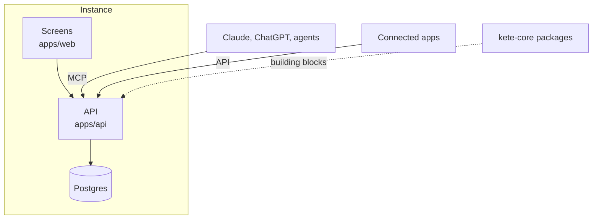

# Kete Enterprise

The chain of a company: its structure, its rights, its decisions, the registry of its resources
(apps, skills, MCP, agents), its agents and its compliance — what exists between its tools, so that
any AI can plug into it safely (doctrine D-028).

- **Read first**: [`CLAUDE.md`](CLAUDE.md), [`docs/ARCHITECTURE.md`](docs/ARCHITECTURE.md),
  [`docs/ROADMAP.md`](docs/ROADMAP.md).
- **Install an instance**: [`deploy/README.md`](deploy/README.md).
- **Run locally**: `pnpm install` (a read:packages token for `@kete-africa` in your user
  configuration), a `.env` from `.env.example`, then `pnpm --filter @kete-enterprise/api dev` and
  `pnpm --filter @kete-enterprise/web dev`.
- **Test**: `pnpm test` (a real Postgres: the Neon `test` branch, or `KETE_TEST_POSTGRES=container`).
