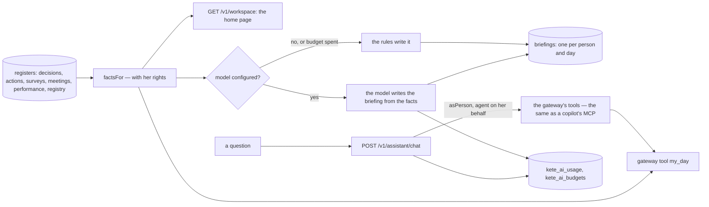

# The person's space, her assistant and her briefing (spec 014)

- **The same tools, the same rights**: the assistant asks `toolsForPerson`, the gateway's registry
  for an agent (`agt_assistant`) acting on behalf of the person; its calls run inside `asPerson`, so
  no tool shows more than the person may see. It prepares and explains; deciding stays hers.
- **AI for reasoning, software for execution**: the facts are read by code; the model only writes
  sentences from them. Without a model, `briefingByRules` writes the same facts in plain sentences.
- **The model is configuration** (D-029): `KETE_AI_PROVIDER`, `KETE_AI_MODEL`, the key in the
  provider's usual variable (`OPENAI_API_KEY`). Every call is metered; a monthly budget stops calls.
- **No pay**: no register of pay is read by `factsFor`, so none reaches a model.
