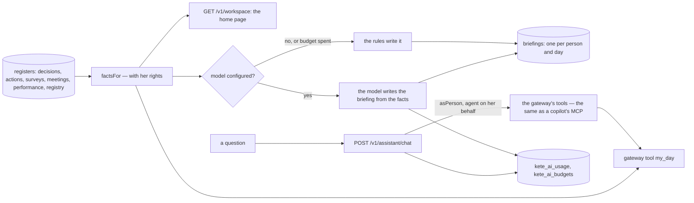
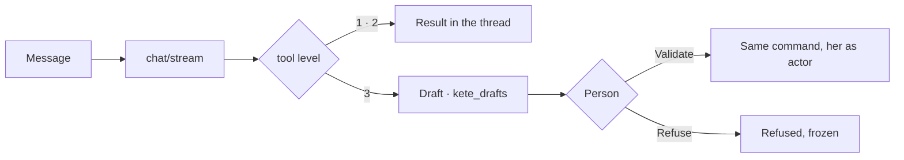
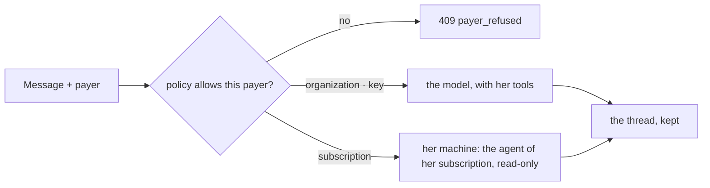

# The person's space, her assistant and her briefing (spec 014)



- **The same tools, the same rights**: the assistant asks `toolsForPerson`, the gateway's registry
  for an agent (`agt_assistant`) acting on behalf of the person; its calls run inside `asPerson`, so
  no tool shows more than the person may see. It prepares and explains; deciding stays hers.
- **AI for reasoning, software for execution**: the facts are read by code; the model only writes
  sentences from them. Without a model, `briefingByRules` writes the same facts in plain sentences.
- **The model is configuration** (D-029): `KETE_AI_PROVIDER`, `KETE_AI_MODEL`, the key in the
  provider's usual variable (`OPENAI_API_KEY`). Every call is metered; a monthly budget stops calls.
- **No pay**: no register of pay is read by `factsFor`, so none reaches a model.

## Drafts and conversations (spec 017)

The assistant prepares drafts (level 3) — an action, a measure from a reading — that the person
validates or refuses, in the chat or in « À faire »; nothing exists before. Its conversations are
kept, one person each, and the chat streams its answer (NDJSON) and can be stopped. See
[spec 017](../../../../../specs/017-drafts-and-chat/spec.md).



## Pay with (spec 026b)

Under the composer, « Payer avec » lets the person choose who pays for her answers — only among
what the organization's policy allows: the organization, her own key (spec 026), or her own
subscription, signed in on a machine of her own. Her subscription answers read-only, without the
gateway's tools; each of its answers is journaled `chat:subscription`, no token counted against the
organization's budget. See [spec 026b](../../../../../specs/026b-pay-with/spec.md).



## Scheduled tasks (spec 029)

Her morning briefing, or a question her assistant answers at a set time, with her rights — asked in
the chat (`schedule_task`) or on « Mes tâches planifiées ». The worker's round takes each task due
once (its next time set first), and the answer lands in « À faire », and by e-mail when she asked.
See [spec 029](../../../../../specs/029-memory-and-schedules/spec.md).

```mermaid
flowchart LR
  C[chat: schedule_task] & P[Mes tâches planifiées] --> S[(assistant_schedules)]
  W[worker · run-schedules · every 5 min] --> D[assistant_schedules_due] --> T[take: next time set first]
  T --> B{kind}
  B -->|briefing| BR[(briefings) · home page]
  B -->|question| Q[asPerson · her tools] --> CV[a conversation] --> TD[(app_tasks) · À faire]
  BR & TD --> M[(mail queue) if by e-mail]
```
