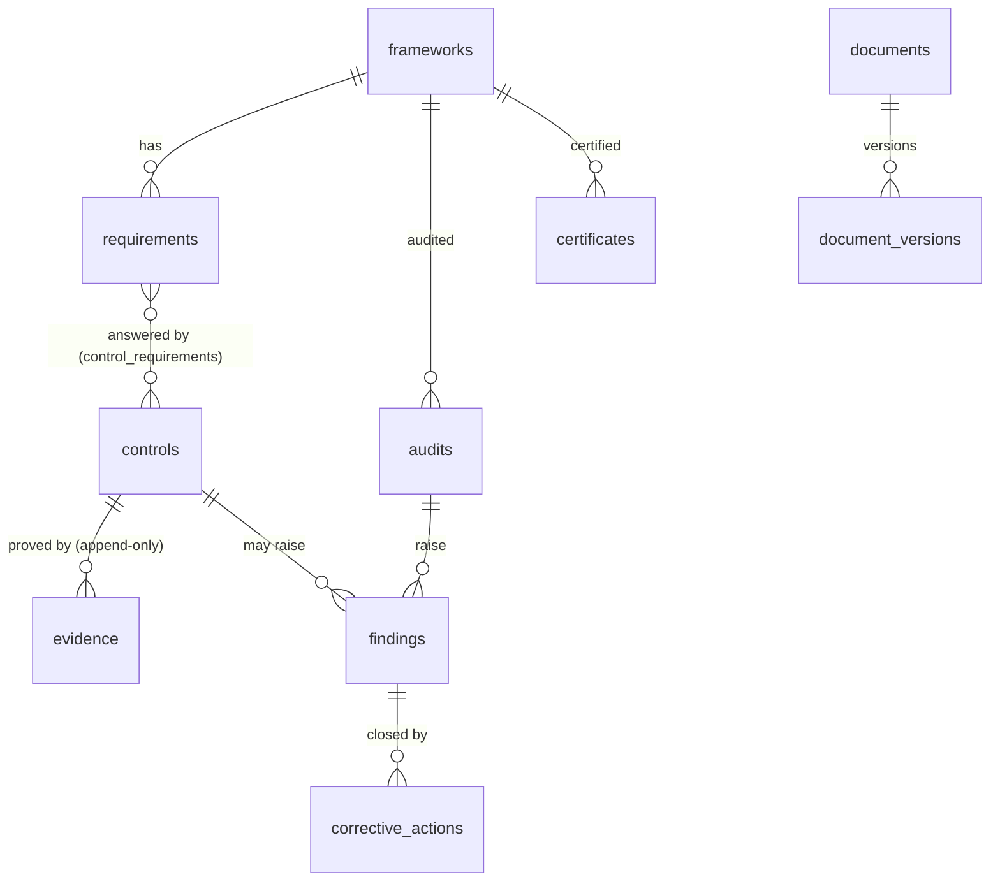

# Compliance (spec 008)

One model for every compliance (doctrine D-040): a **framework** (a standard, a law, an internal
policy, a client's requirements, a contract) has **requirements**; **controls** answer them — one
control serving several frameworks; **evidence** proves a control; **audits** raise **findings**;
**corrective actions** close them; **certificates** record what a body certified. Kete prepares and
proves; only an accredited body certifies.

- **Never a standard's text**: a requirement keeps its clause's reference and a summary in the
  company's own words.
- **Evidence** is a record: its source (`automatic` or `attestation`), outcome, summary, details,
  SHA-256 fingerprint, who collected it, until when it is valid (the control's frequency). It is
  append-only: a newer one supersedes it.
- **Automatic checks** read the company's own records, in its organization's transaction:
  `registry.apps_have_card`, `decisions.no_overdue`, `agents.act_for_someone`,
  `structure.positions_filled`, `compliance.actions_on_time`. An **attestation** comes from the
  holder of the control's owner position, or a compliance manager.
- **Status** of a control, today: `passing`, `failing`, `expired`, `missing`. A framework shows its
  requirements with their controls and statuses — never a percentage.
- **Four eyes**: a document's version is approved by someone other than its author (the approved
  one before becomes obsolete); a corrective action is done by its owner and its effectiveness
  verified by someone else; a finding closes when all its actions are verified.
- **The controls watch** (`compliance`, needs `compliance:read`): an agent whose person may read
  compliance for the whole organization signals controls failing, expired or missing, overdue
  actions and certificates expiring within sixty days (spec 007). It changes nothing.

## Routes, under /v1/compliance

`GET /` (« compliance:read »): the overview. Everything else needs « compliance:manage », except
attesting (the owner position's holder) and completing an action (its owner): `POST /frameworks`,
`/requirements`, `/controls`, `/controls/links`, `/controls/:id/collect`, `/controls/:id/attest`,
`/documents`, `/documents/:id/approve`, `/audits`, `/audits/:id/conclude`, `/findings`,
`/actions`, `/actions/:id/complete`, `/actions/:id/verify`, `/certificates`.
