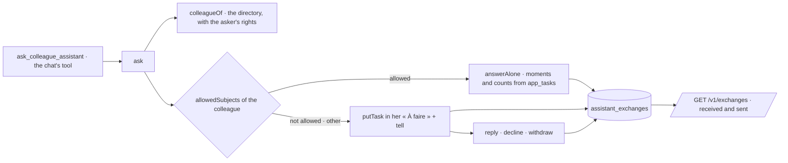

# Exchanges between assistants (spec 057)

A person's assistant asks a colleague's. Answered alone only on the subjects the colleague
allowed, by fixed rules; otherwise passed to the colleague, who answers or not. Both see it.

- `assistant_exchange_settings` holds what each person allows (nothing by default);
  `assistant_exchanges` keeps every exchange. Both are isolated by organization (RLS) and
  filtered by person in every query.
- `answerAlone` never calls a model and never returns a title, a source or a name.
- The task's key is the exchange's id: answering, declining or withdrawing closes it.
