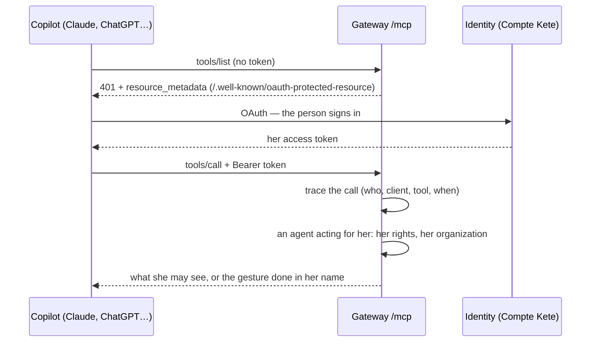
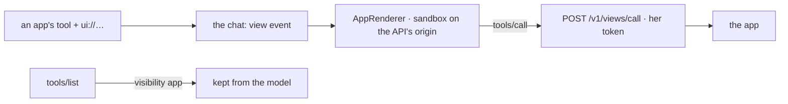

# Gateway (spec 006)

One MCP address for the whole company (`<PUBLIC_API_URL>/mcp`); what each person's copilot sees
and does is what her rights allow (doctrine D-028, ARCHITECTURE §13, principle 4).

| Tool                | Level | What                                                                          |
| ------------------- | ----- | ----------------------------------------------------------------------------- |
| `structure_chart`   | 1     | The organization as she sees it at a date (spec 002, 003)                     |
| `registry_list`     | 1     | The resources she sees, with owner, tier, risk and flags (spec 004)           |
| `registry_register` | 2     | Registers a resource in her own space; undone by retiring it                  |
| `decisions_inbox`   | 1     | What waits for her decision, and her requests; deciding stays hers (spec 005) |

- **The same rules as the screens**: the tools read `chartFor`, `registryFor` and `inboxFor`, the
  functions the screens' routes use; a gesture runs its named command with its journal, the actor
  being `agt_gateway` acting `onBehalfOf` the person, through the `mcp` channel.
- **No decision through a copilot**: `decide-request` refuses any actor but a person.
- **Traced**: every `tools/call` is recorded in `gateway_calls` (append-only, RLS); the person reads
  her own at `GET /v1/gateway/calls`, and the home screen shows them.

## The apps' views in the chat (spec 029b, MCP Apps)

When an app's tool names a view (`_meta.ui.resourceUri`), the chat shows it with the result, drawn
by mcp-ui's `AppRenderer` in a double frame on the API's origin (`GET /views/sandbox`). The view's
page is read with `GET /v1/views`, and its calls go through `POST /v1/views/call` with the person's
own token. A tool meant for the view alone (`visibility: ["app"]`) never reaches the model. See
[spec 029b](../../../../../specs/029b-app-views/spec.md).

