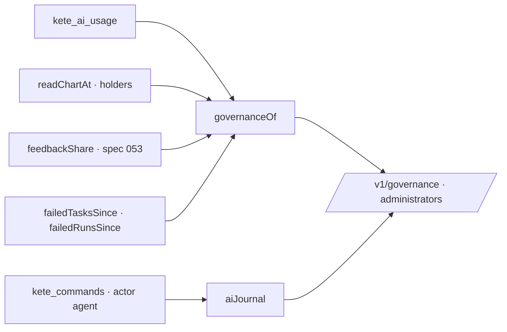

# Governance of AI (spec 054)

What the organization spent on models this month, team by team; the share of answers its people
found useful; what failed; and the journal of what its AI did — for administrators.

- A use counts for the person it was for (`on_behalf_of_id`, else its actor), in the unit of the
  position she holds today.
- The journal reads `@kete/commands`' journal as it is: who, for whom, through which channel,
  whether it can be undone. Its CSV is built in the browser.
