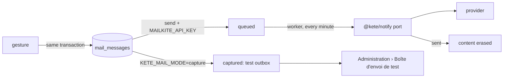

# E-mails and the test outbox (spec 010)

Features write to people through `queueMail`, **in the transaction of their gesture**: an e-mail
leaves only if the gesture commits. Every e-mail uses one plain layout (`renderMail`): the same words
in HTML and text, the action as a button and as a link one can copy.

- **Capture** is the default: staging, demos and any instance without a provider. Nothing leaves;
  administrators read each e-mail as its recipient would, and its links work.
- **Send** needs `KETE_MAIL_MODE=send` and `MAILKITE_API_KEY`. Once sent, an e-mail's content is
  erased: it may carry a personal link.
- The words of the frame live in `words.ts` (French, English); each feature keeps its e-mails'
  words beside it.
