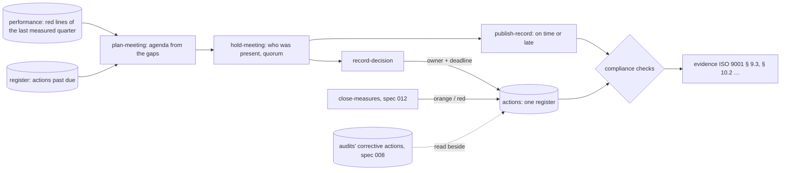

# Meetings, decision notes and the register of actions (spec 013)

Principle P5 of KYA-ORG-CIBLE-01 — « mesurer avant de réunir »: a meeting decides on gaps, it
does not report orally. Its agenda is drawn from the measures, its decisions become dated actions,
its record is on time or late, and the evidence of ISO 9001 follows on its own.

- **Meeting types** carry their cadence, members (positions), quorum and the delay of their record
  (48 h for the Codir). Kinds: `decision`, `operations`, `quality` (the management review),
  `information`, `innovation` (brainstorming: decisions can be ideas, kept in the innovation
  register).
- **Records** are readable by everyone once published; before, only by those who run meetings.
- **Decision notes** take the next number of the year at publication — `2026-012/DG/KEG`, the code
  being the top unit's — under a lock, so numbers never repeat; each person acknowledges reading.
- **Actions** (`features/actions`): one owner, one deadline, overdue first; the owner closes hers
  with what was done. Closing a quarter's measures opens one action plan per review with reds or
  oranges, owned by the person's manager.
- **Evidence**: the compliance checks `meetings.management_review_held`,
  `meetings.records_on_time`, `actions.on_time`, `performance.reviews_held` and
  `surveys.customers_heard` read these registers.
