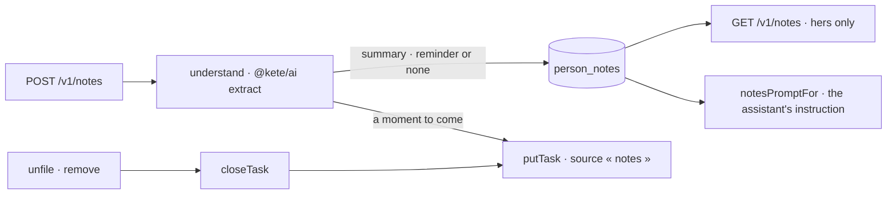

# Notes (spec 055)

« Noter » and « Mon carnet »: a person writes down what she knows, as on paper. The note is kept,
understood by the organization's model, and a reminder is filed in her « À faire » when it names a
moment to come. Her assistant reads her latest notes. Hers alone.

- `person_notes` is isolated by organization (RLS) and filtered by `user_id` in every query.
- A note is kept even when no model is configured or understanding fails; then nothing is filed.
- The reminder's key is the note's id: undoing or removing the note closes the same task.
- Under « view as » (demo organizations) the list is empty, writing is refused, and the assistant
  receives no notes.
