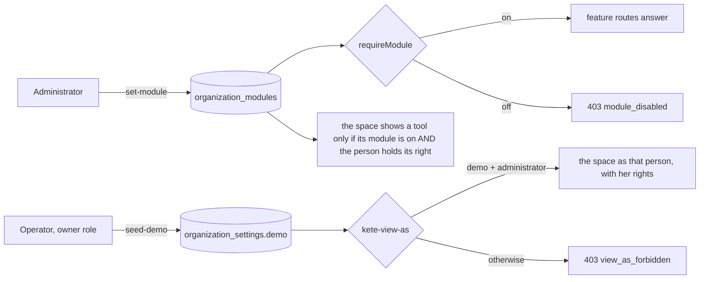

# Modules and demo organizations (spec 010)

The business tools are generic (doctrine D-041): an organization switches on the ones it uses.

- Modules: `surveys`, `performance`, `meetings` (off until switched on), `compliance`, `agents`
  (on until switched off, as they were before modules existed). Switched off, a tool's data stays.
- Whether an organization is a **demo** is the instance operator's decision: the application role
  reads `organization_settings` and never writes it. Only in a demo, an administrator may send
  `kete-view-as: prs_…` to act as a person **who has an account**, with that person's rights — the
  seed gives demo people demo accounts that never sign in.
- `scripts/seed-demo.ts --organization <id>` seeds the KYA profile (`db/demo/kya.ts`): the
  structure of decision 2026-010, the positions of the referentials, fictitious people at
  `kya-demo.test`, roles, and every module on. Run again, it keeps the structure and brings roles
  and modules up to date.
