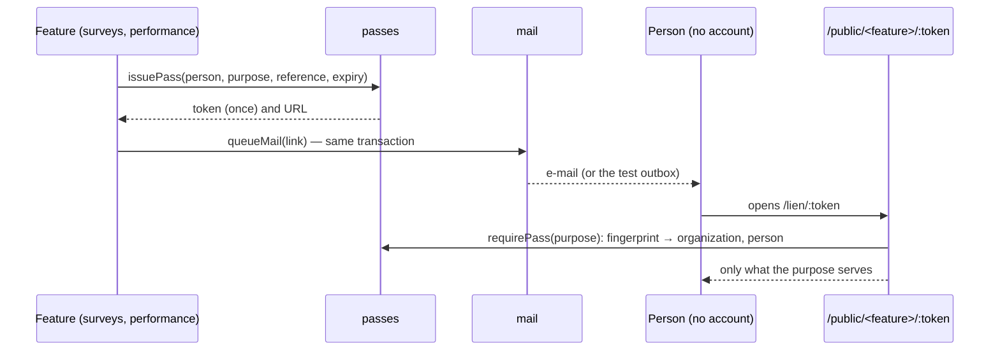

# Personal links (spec 010)

A technician on a site has no account, and must still answer the quarter's survey or sign his
review. A feature issues him a **personal link** for one purpose (`surveys.answer`,
`performance.review`) and one reference (a campaign, a review); the link opens that and nothing
else.

- The table `person_passes` keeps a SHA-256 **fingerprint**, never the token (32 random bytes).
- A link carries no organization: the definer function `pass_by_fingerprint` finds it from the
  fingerprint alone, and only for a live link (not expired, not revoked).
- A new link for the same person, purpose and reference revokes the previous one;
  `revokePasses(purpose, reference)` closes them all (a closed campaign).
- Wrong, expired and revoked links look the same from outside: `404 link_invalid`.
- Gestures through a link run as the person (`actor: { kind: 'person', id: prs_… }`), in her
  organization's transaction, journaled like any other.
