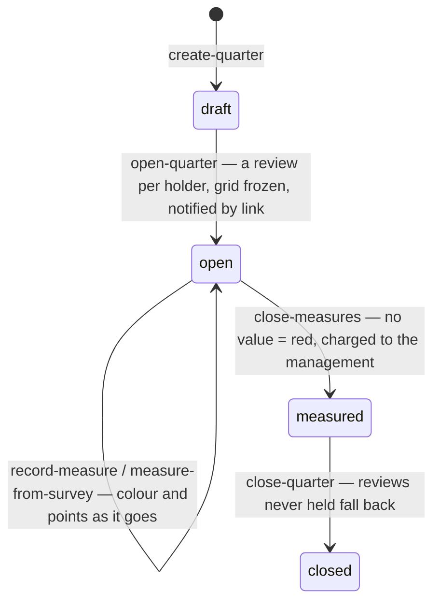
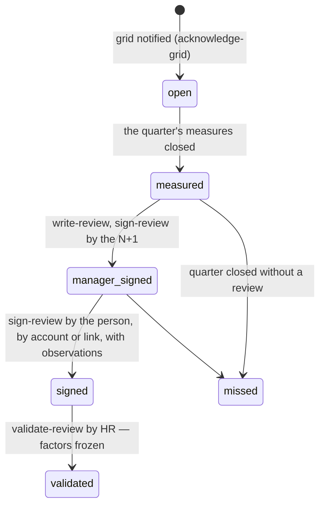

# Performance — indicators, grids and the quarterly review (spec 012)

The chain of KYA-ORG-CIBLE-01 § 3.3–3.5 and KYA-KPI-01, held by one tool: a catalogue of
indicators with their six attributes, job profiles (one grid per position type), quarters whose
grids are frozen and notified, measures with their proof, a written review signed by both, HR's
validation, and the factors that the variable pay will use. Generic: any organization imports its
own referential.

- **Colours** (`compute.ts`): green at the target, orange before the threshold, red past it (the
  comparison is the threshold's own: « < 80 % », « > 48 h », « 0 séance »); a target in words gets
  the colour whoever measures chooses; no value is red.
- **Points**: green 100 %, orange 60 %, red 0 % of the weight (the quarter's scale). A penalising
  line out of the sum multiplies by 1 / 0.5 / 0 by number of incidents; a blocking line in red
  sets the individual factor to 0. Under **progressivity**, only reliable sources count, weights
  renormalised; the others are shown « for observation ».
- **Factor**: individual × its weight + collective (the nearest unit above with a factor:
  direction, agency, service) × its weight + group × its weight; nothing without the group's
  trigger. A review never held gets the average of the person's last two validated quarters.
- **Who**: `performance:manage` (HR: referential, quarters), `performance:measure` (management
  control: values, collective and group factors, the arrêté), `performance:validate` (HR),
  `performance:read` (the Codir). The manager of a review is found in the structure at the opening
  (spec 002, `reportingLines`), past vacant positions.
- **Sources**: `measure-from-survey` takes a published survey's score (spec 011) for the section
  about the person's unit — or the nearest above — and writes the campaign as its proof.
- **Readings** (spec 015): a connected app — `kete-helpdesk` for its tickets — sends a value of an
  indicator for a quarter with its proof (`POST /v1/performance/readings`, append-only). It is a
  source: management control takes it into a review's line (`measure-from-reading`), or not.
