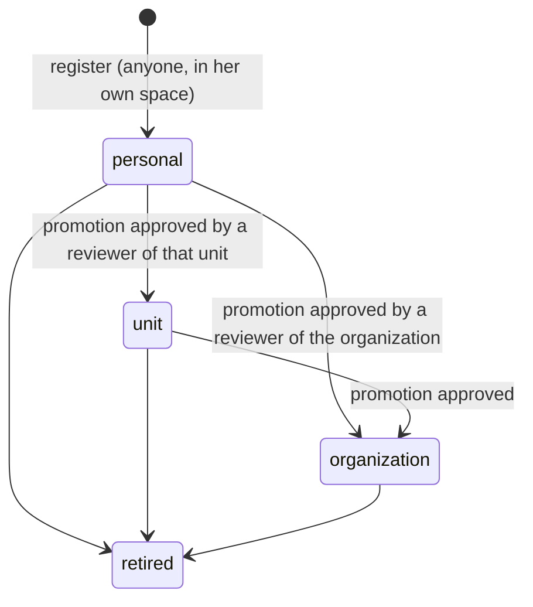

# Registry (spec 004)

Every app, skill, MCP server and agent a company's people create enters here, with an owner, a
tier and a risk, before it spreads (doctrine D-028, D-040).

- **Spaces**: a resource starts in its owner's personal space, visible to her only (and to the
  organization's reviewers). Promoted to a unit, it is visible to the people of that unit and below;
  to the organization, to everyone.
- **Identity card**: for an app or an MCP server, the API reads `<address>/.well-known/kete`
  (`manifest.v1`, kete-core spec 035) itself — over the public internet only (`https`, every
  resolved IP public, no redirection, 5 s, 100 kB). The caller never supplies the card.
- **Risk**, from the card: **high** when an outage stops work or loses money (criticality high or
  critical) or when it handles sensitive data (special categories, children, payment, credentials);
  **medium** for people's or the company's data, or AI; **low** otherwise; **unknown** without a
  card. The inventory flags an app without a card (`no_card`) or a card without an owner
  (`no_owner`).
- **Review**: a person with `registry:review` on the target decides; a high-risk resource needs a
  reviewer of the whole organization; **nobody decides her own request**.

## Gestures

| Command                 | Route                                        | Who                      |
| ----------------------- | -------------------------------------------- | ------------------------ |
| `register-resource`     | `POST /v1/registry/resources`                | anyone                   |
| `refresh-identity-card` | `POST /v1/registry/resources/:id/refresh`    | its owner, or a reviewer |
| `request-promotion`     | `POST /v1/registry/resources/:id/promotions` | its owner                |
| `decide-promotion`      | `POST /v1/registry/promotions/:id/decide`    | a reviewer of the target |
| `retire-resource`       | `POST /v1/registry/resources/:id/retire`     | its owner, or a reviewer |

`GET /v1/registry` gives the resources the person sees (with their flags), the promotions she may
decide, and her own pending requests. Spec 005 will route promotions through approval circuits;
spec 006 will expose these gestures to Claude through the MCP gateway.
