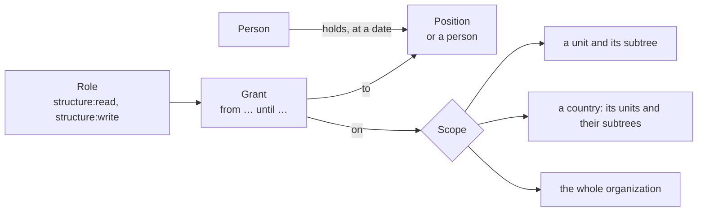

# Rights (spec 003)

Rights follow the structure (spec 002): a **role** (a name and its permissions) is **granted** to a
position or a person, on a **scope**, for a period. Whoever holds the position has its rights; when
the holder changes, the rights move with the position (doctrine D-028, ARCHITECTURE §13).



- **Scopes**: a unit covers its whole subtree; a country covers its units and everything under them;
  no scope covers the organization.
- **Any assignment carries the position's rights for its period**: an interim, a delegation.
- **The organization's owners and admins** at the Compte Kete hold every permission everywhere: they
  grant the others.
- **Without any grant**, a person sees the units where she holds a position.
- **Agents** never hold more than the person they act for (principle 4); their own narrowing comes
  with spec 007.
- **The apps' permissions** (spec 022): each app declares them in its card; a role carries them as
  `<product>#<permission>` (`prd_kete_helpdesk#tickets:manage`), granted like the others. The app
  reads a person's grants at `GET /v1/apps/:product/grants` (feature `apps`).

## One evaluation for every feature

```ts
import { covers, reach } from '../rights/index.js';

const scope = await reach(db, identity, 'structure:write', asOf); // { everywhere, units }
if (!covers(scope, unitId)) refuse(); // `null` stands for the organization as a whole
```

Each feature declares its permissions (`structurePermissions`, `rightsPermissions`); the API
assembles the catalog, and a role allows only permissions that exist.

## Gestures

| Command                | Route                                       | Needs « rights:manage » |
| ---------------------- | ------------------------------------------- | ----------------------- |
| `create-role`          | `POST /v1/rights/roles`                     | everywhere              |
| `set-role-permissions` | `POST /v1/rights/roles/:roleId/permissions` | everywhere              |
| `grant-role`           | `POST /v1/rights/grants`                    | on the grant's unit     |
| `revoke-grant`         | `POST /v1/rights/grants/:grantId/revoke`    | on the grant's unit     |

`GET /v1/rights/me` says what the person may do and where; `GET /v1/rights` lists roles and current
grants for whoever manages rights everywhere; `GET /v1/rights/permissions` gives the catalog.
