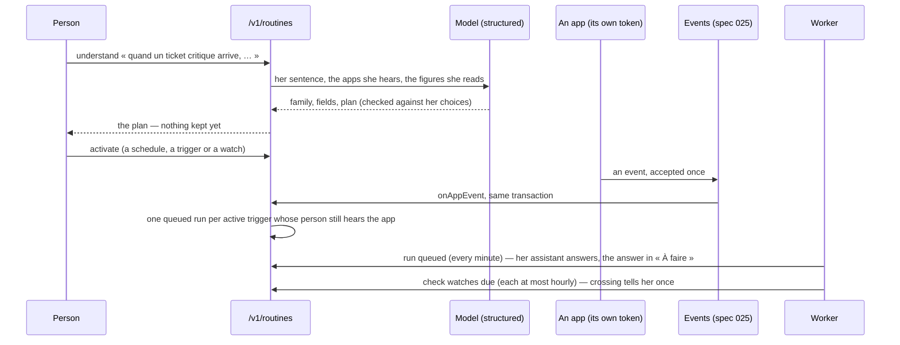

# Routines (spec 051)

What runs for a person without her, in three families, each with her rights and never more: at a
set time (her scheduled tasks, spec 029), when an app of her team signals (triggers), when a
figure of a dashboard she reads crosses its line (watches). She writes it in a sentence, reads its
plan, activates it; every run is kept.

- **Triggers** name an app of the registry she hears — shown to her, her rights in it giving her
  something — and one of the event types its card declares. A secret event never triggers: its
  data never reaches a model.
- **Watches** name a dashboard she reads, a figure card (a card shown as a number), a direction
  and a line. Crossing the line tells her once (`routine.watch`), and again only after the figure
  came back.
- **Runs** (`routine_runs`): every run, queued, scheduled, watched or tried, with its family, its
  cause, its outcome and a short answer. The scheduled tasks' runs reach the history through
  `onScheduleRun`.
- **Across organizations** the worker learns only identifiers (`routine_runs_queued()`,
  `routine_watches_due()`, security definer), then works each in its organization's transaction.
- **Without a model**, understanding answers `assistant_unavailable`; she fills the same fields
  herself.
