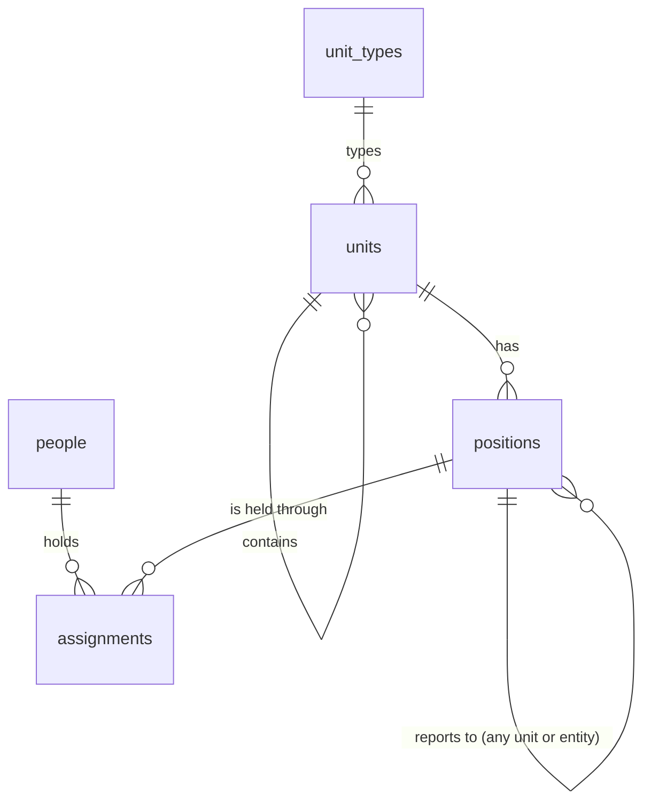

# Structure (spec 002)

Where each person is in the organization, at any date (doctrine D-028, D-041): units with types
the organization names itself, positions in units, people, and dated assignments. Everything after
uses it: rights have a scope in this tree (003), approvers are found through it (005).



- **Generic primitives** (D-041): a legal entity is a unit whose type says so; a country is a
  unit's attribute; nothing is called « company » or « department » in the tables.
- **Dated**: units and positions open and close; assignments start and end. The chart can be read
  at any date (`GET /v1/structure?asOf=2026-06-01`). Nothing is deleted.
- **Assignment kinds**: `primary` (one at a time per person), `functional`, `project`, `interim`,
  `delegation` (used by the decision circuits, spec 005).
- **People** may have no Compte Kete account (field staff); one who has is linked by its identifier.

## Gestures

| Command            | Route                                    | Reversible by    |
| ------------------ | ---------------------------------------- | ---------------- |
| `create-unit-type` | `POST /v1/structure/unit-types`          | —                |
| `create-unit`      | `POST /v1/structure/units`               | `close-unit`     |
| `move-unit`        | `POST /v1/structure/units/:unitId/move`  | `move-unit`      |
| `close-unit`       | `POST /v1/structure/units/:unitId/close` | —                |
| `create-position`  | `POST /v1/structure/positions`           | `close-position` |
| `close-position`   | `POST /v1/structure/positions/:id/close` | —                |
| `add-person`       | `POST /v1/structure/people`              | —                |
| `assign-person`    | `POST /v1/structure/assignments`         | `end-assignment` |
| `end-assignment`   | `POST /v1/structure/assignments/:id/end` | —                |

Each runs in the organization's transaction with its journal entry (`@kete/commands`) and an
`Idempotency-Key`. A person's name, e-mail and phone stay out of the journal.

```mermaid
sequenceDiagram
  participant S as Screen (owner or admin)
  participant A as API
  participant D as Postgres (RLS)
  S->>A: POST /v1/structure/assignments + Idempotency-Key
  A->>A: owner or admin? input valid?
  A->>D: lock the person; a primary assignment over the period?
  alt overlap
    A-->>S: 409 primary_overlap
  else
    A->>D: insert the assignment + its journal entry, in one transaction
    A-->>S: 201
  end
```

## Refusals

`forbidden` (403, not an owner or admin, until spec 003), `not_found` (404, also for an identifier
of another organization), `cycle`, `closed`, `primary_overlap`, `ends_before_start` (409),
`invalid_input`, `idempotency_key_required` (422).
