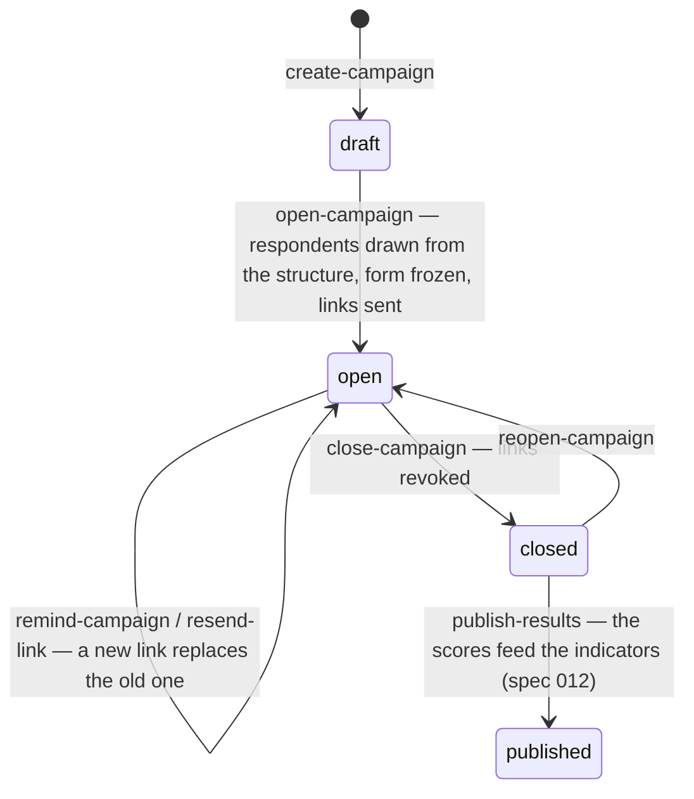
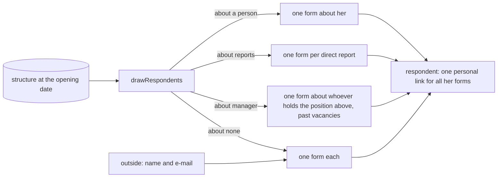

# Surveys (spec 011)

Questionnaires, campaigns sent by personal link, answers, and results on 100 that feed the
indicators. Generic: an organization runs its own; HR and QHSE run them in their space with
`surveys:manage`, the administrators only grant the right and switch the module on.

- **Answering**: by personal link (`/public/surveys/:token`, purpose `surveys.answer`, reference
  the respondent) or from the space (`/v1/surveys/mine`). Drafts are saved; a sent form never
  changes. The answers are never written in the journal.
- **Anonymity**: an anonymous form loses its respondent **at submission**; the respondent keeps
  only counts. Follow-up shows who answered, never what. A group with fewer answers than the
  campaign's minimum (3 by default) shows no score; free texts are listed sorted, without author.
- **Score on 100**: `(average − 1) ÷ 4 × 100` of the 1-to-5 ratings, « not applicable » left out;
  a yes/no gives its share of « yes ».
- **No e-mail**: the link of a person without an e-mail goes to whoever runs the campaign, to pass
  on by hand.
- `surveyScores(campaignId)` gives a published campaign's results to the indicators.
