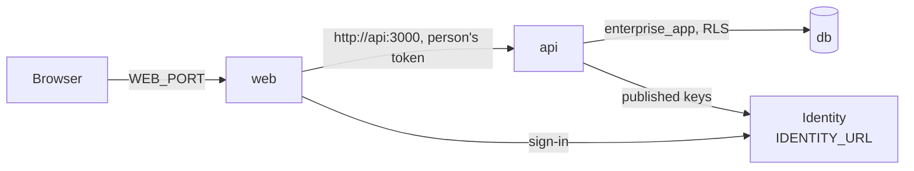

# Install an instance

An instance of Kete Enterprise runs on one machine with Docker: Postgres (with pgvector), the API
and the screens. It never calls Kete to work (doctrine D-029).

1. Register the screens at the identity (the Compte Kete, or the instance's own) as a client, with
   the redirect `<PUBLIC_URL>/auth/callback`: it gives `CLIENT_ID` and `CLIENT_SECRET`.
2. Create `deploy/.env` (never committed) with: `OWNER_PASSWORD`, `APP_PASSWORD`, `IDENTITY_URL`,
   `PUBLIC_URL`, `CLIENT_ID`, `CLIENT_SECRET`, `SESSION_SECRET` (at least 32 characters), and
   optionally `WEB_PORT`, `API_IMAGE`, `WEB_IMAGE`.
3. `docker compose --env-file deploy/.env -f deploy/docker-compose.yml up -d`

Until the images are published, build them from the repository root:
`docker build -f apps/api/Dockerfile --secret id=node_auth_token,env=NODE_AUTH_TOKEN -t kete-enterprise-api .`
(and the same for `apps/web`), then set `API_IMAGE` and `WEB_IMAGE`.

The first start creates the API's role (`init/01-app-role.sh`), then the API applies its
migrations and serves. Updating is pulling newer images and starting again; the migrations follow.
