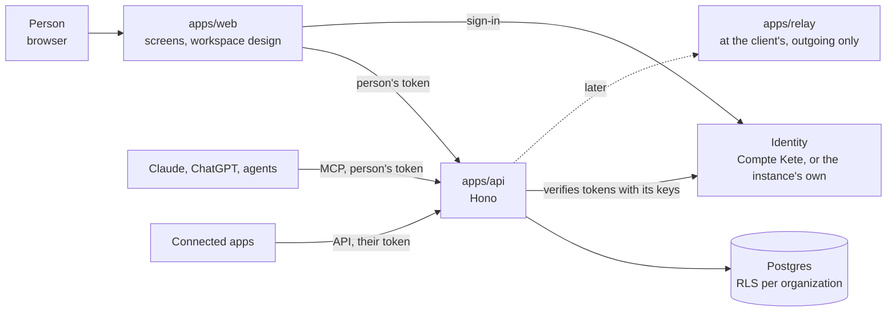

# Architecture

Kete Enterprise is the chain of a company: what exists between its tools (doctrine D-028). This
document says how it is built; `docs/ROADMAP.md` says in which order.

## The pieces



- **One door: the API** (D-029). The screens, the MCP gateway, agents and connected apps all go
  through it, with a person's token; it owns the database. Nothing reaches the database another way.
- **The screens hold no data.** They sign the person in with the identity, keep her token
  server-side only, and call the API on her behalf: never more than her rights.
- **The identity** is the Compte Kete on Kete's shared instance; an autonomous instance has its own
  (D-011, D-028). The API only needs its issuer address and published keys.
- **The organization is the boundary** (D-041): every table carries `organization_id` and its RLS
  policy in the same migration; the API connects with a role that cannot bypass it.

## Inside the API

```
apps/api/src/
  app.ts                 the routes: /health, /.well-known/kete, /v1/* behind a person's token
  platform/              the wiring, no business rule: env, database, identity, manifest
  features/<feature>/    one vertical slice each: domain, commands, queries, routes, README
db/migrations.ts         every table with its row-level security, in order
```

Features (in order, `docs/ROADMAP.md`): `structure`, `rights`, `registry`, `decisions`, `gateway`,
`agents`, `compliance`. A feature is used only through its `index.ts`.

kete-core's building blocks do the common work (D-030): `@kete/tenancy` (organization transactions),
`@kete/commands` (named gestures, journal, chain of agents), `@kete/drafts` and
`@kete/capabilities` (the AI prepares, a person decides), `@kete/sdk` (manifest, health, outbox),
`@kete/auth` (tokens), `@kete/jobs` (the worker), `@kete/design` (screens).

## Where it runs

- Any Postgres 16 or more (with pgvector) and any S3-compatible storage; Docker Compose
  (`deploy/`) or Coolify; never a call to Kete to work (D-029).
- Two images: `apps/api` (it applies its migrations at start-up) and `apps/web`.
- Kete's own instances use the Neon project `kete-enterprise` (`docs/OPERATIONS.md`).
