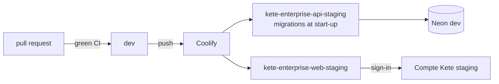

# Operations

How Kete runs its own instances of Kete Enterprise. A client's autonomous instance follows
`deploy/README.md` instead.

## Databases

The Neon project `kete-enterprise` (Postgres 17, pgvector), database `kete_enterprise`:

| Branch | For                                                    |
| ------ | ------------------------------------------------------ |
| `main` | Production (when the author decides the first release) |
| `dev`  | Staging                                                |
| `test` | Local integration tests (CI uses a plain Postgres)     |

Two roles: `enterprise_owner` (migrations) and `enterprise_app` (the API: login, no `BYPASSRLS`).
Their passwords live only in the deployment's environment; none is written in this repository.

## Staging

- Coolify builds `apps/api/Dockerfile` and `apps/web/Dockerfile` from the repository root on each
  push to `dev`, with the build secret `node_auth_token` (a read:packages token; "Use Docker Build
  Secrets" on).
- The API's environment: `DATABASE_URL`, `OWNER_DATABASE_URL`, `KETE_ACCOUNT_URL`,
  `KETE_ENVIRONMENT=staging`. The web's: `PUBLIC_URL`, `API_URL`, `KETE_ACCOUNT_URL`,
  `KETE_CLIENT_ID`, `KETE_CLIENT_SECRET`, `SESSION_SECRET`.
- The web is registered at the Compte Kete as a trusted client, with the redirect
  `<PUBLIC_URL>/auth/callback`.
