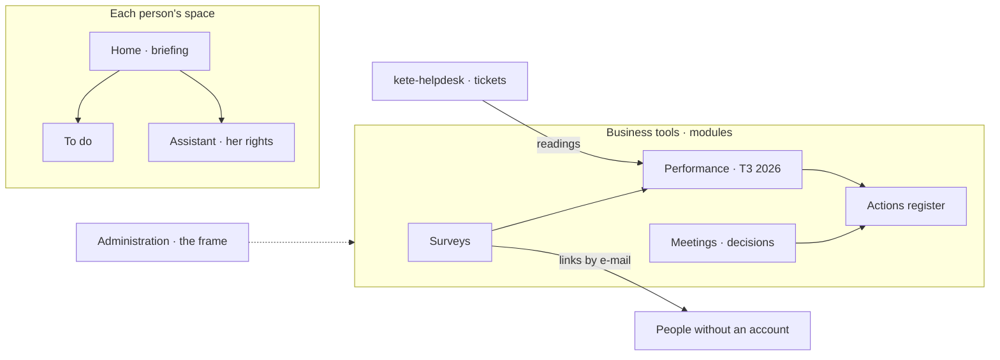

# The KYA demo — « Pilotage & Performance »

A demo of Kete Enterprise for KYA-Energy Group's general management. KYA's real structure
(decision 2026-010) and indicators (KYA-KPI-01); every person and e-mail is fictitious
(`@kya-demo.test`). Everything runs on staging; nothing touches production.

| What                    | Where (staging)                                          |
| ----------------------- | -------------------------------------------------------- |
| Kete Enterprise         | `https://enterprise-kete-staging.13.140.178.49.sslip.io` |
| Support (kete-helpdesk) | `https://helpdesk-kete-staging.13.140.178.49.sslip.io`   |
| Compte Kete             | `https://compte-kete-staging.13.140.178.49.sslip.io`     |

## What the demo proves

1. **Each person has her space**: her home, her briefing of the morning, her to-do, her assistant
   acting with her rights and never more.
2. **Business tools belong to the business**: surveys (HR, QHSE), performance (management
   control, managers), meetings and decisions (general management) — switched on per
   organization, generic, inside Kete Enterprise. The Administration holds only the frame.
3. **Surveys go out as direct links by e-mail**: no account needed; technicians answer from their
   phone.
4. **Anyone may launch an app that integrates**: kete-helpdesk was born from
   `pnpm create @kete-africa/app`, registered by its owner, promoted to the organization, and its
   indicators flow into the reviews as readings.
5. **Scattered flows are channelled**: one structure, one journal, one register of actions; the
   documents are only final exchanges with outsiders.

## Preparation (operator, about 30 minutes)

1. In the staging Compte Kete, create the organization « KYA démo » and note its id. Its owner is
   the person who presents.
2. The instance's operator seeds it, from `apps/api`, against the staging database:
   `tsx scripts/seed-demo.ts --organization <id>`. It marks the organization as a demo and
   brings 36 units, 50 positions, 34 fictitious people, the roles, every module, three
   questionnaires, the KYA-KPI-01 referential (48 profiles), the quarter T3 2026, five meeting
   types, ISO 9001 with five automatic controls, and the registry's resources.
3. Seed the helpdesk's demo tickets for the same organization: two queues (SAV & Maintenance,
   Support informatique) and 26 fictitious tickets restored during T3 2026. Expected: SAV 68.8 %
   within target (11 of 16), IT 80 % (8 of 10).
4. Set `OPENAI_API_KEY` on the staging API in Coolify (model `gpt-6.1-sol`): without it, the
   briefings follow rules and the assistant says it has no model.
5. Keep `KETE_MAIL_MODE=capture`: every e-mail lands in Administration › Boîte de test, whose links
   open for real.

## The demo, act by act (about 35 minutes)

### Act 1 — The frame, in two minutes (Administration)

- `/administration`: the frame (units, people and accounts, rights, modules, circuits, registry)
  and « Ce qui bouge »: the registry's promotions to decide, the agents, the model and its tokens,
  compliance.
- `/administration/organisation`: the organization in three formats — the chart of positions
  (boxes and lines, holders, vacancies, fold and unfold), the tree of units, the table of
  positions; select a position and it opens in the detail pane. « Dessiner l'organisation » opens
  a side panel: every addition opens the same way, in the same place.
- `/administration/modules`: the business tools are switched on per organization; switching one
  off hides it and its data stays.
- Say it: the Administration does not run surveys or reviews; the business does, in its space.

### Act 2 — A person's morning (5 minutes)

- Administration › Démo › « Voir comme » **Abla Nyuiadzi** (head of SAV & Maintenance).
- `/`: her briefing of the morning, drawn from her facts: what she has to do, her red lines, her
  overdue actions, the meetings ahead.
- `/`: the figures at the top (forms, decisions, actions, notes), then the briefing.
- `/assistant`: « Qu'est-ce que j'ai à faire aujourd'hui ? », then « Quelles sont les actions en
  retard de mon service ? ». The answer comes as it is written, formatted; each tool it used is a
  card; « stop » stops it; the conversation is kept in the list on the left.
- `/mes-agents`: the agents acting for her, their mission, scope, level and signals — an agent
  never holds more rights than her.

### Act 3 — Surveys by link, no account (7 minutes)

- View as **Mawuena Kpodar** (DGA, coordinating HR). `/enquetes`: the questionnaire « Satisfaction
  du personnel envers les services » (anonymous, each section about a unit).
- Open a campaign for everyone, then the outbox `/administration/boite-de-test`: one personal link
  per respondent; those without an e-mail are relayed to the campaign's runner.
- Open one link in a private window: the form, no account, on a phone width. Answer, submit.
- Back in the campaign: answers counted, scores per unit, small groups hidden.
- Mention the two others: « Satisfaction client » (outside respondents) and « Évaluation du
  responsable (N+1) », whose scores feed a review line (`measure-from-survey`).

### Act 4 — An app launched by a business owner (6 minutes)

- Tell it: the SAV needed tickets with a clock. kete-helpdesk was created with
  `pnpm create @kete-africa/app kete-helpdesk` in `kete-africa`: sign-in through the Compte Kete,
  each organization apart, the journal, the MCP endpoint, CI green on the first commit.
- Open Support: `/tickets` (open tickets, most critical first), a ticket and its clock — it starts
  at the acknowledgement, stops at the restoration, motivated suspensions set aside.
- `/indicateurs`: period T3 2026 (2026-07-01 to 2026-09-30), « Envoyer à Kete Enterprise ». The
  reading lands in Kete Enterprise, append-only, with its proof.
- In Enterprise, `/ressources` › « Inscrire une ressource » (a side panel): the app by its
  address; its identity card (`/.well-known/kete`) is read, its risk deduced. Open it in the
  detail pane, ask its promotion to the organization; a reviewer decides it in
  `/administration/registre`. It now appears in the sidebar under « Apps de l'équipe ».
- As yourself (not « Voir comme »), in the central chat: « Ouvre un ticket SAV critique : onduleur
  en panne chez un client à Agoè ». The assistant uses Support's own tool, with your token: the
  ticket is in Support.
- In Support, acknowledge it: « Rétablir : … » appears in Enterprise › À faire, under « Dans vos
  apps », with its deadline; restored, it leaves.

### Act 5 — Performance T3 2026, the variable part (10 minutes)

- View as **Afi Mawufemo Agbo** (management control). `/performance/<T3 2026>`: open the quarter
  (it is a draft after the seed): the reviews of every holder appear, frozen lines of their job
  profile (KYA-KPI-01), the scale green 1 / orange 0.6 / red 0, progressivity.
- `/assistant`: « Quels relevés des apps puis-je reprendre ? » — the assistant lists the reading
  Support sent for Abla Nyuiadzi's line « Respect du délai d'intervention contractuel (SLA) ».
  « Prépare la mesure » — a draft card appears under the answer: the review, the line, the
  reading in words, « préparé par l'assistant ». Nothing is measured yet. « Valider »: the measure
  is written, with Afi as the actor. The same card waits in À faire if she closes the chat.
- Open Abla Nyuiadzi's review: the line shows 68.8 % and its proof.
- Close the measures: a missing measure is red and opens an action plan in the register.
- View as **Folly Ayité** (her manager): write the review and sign. Abla signs from her space, or
  a person without an account from the link she receives. HR validates.

### Act 6 — Meetings, decisions, actions (5 minutes)

- View as **Komlan Adjévi** (DG). `/instances`: the « Revue opérationnelle hebdomadaire » — its
  agenda is drawn from the gaps: red lines of the last measured quarter, overdue actions.
- Hold it: attendance and quorum, decisions that become actions with an owner and a date, the
  record on time or late. A decision note gets its number `2026-NNN/DG/<unit>` and its reads.
- `/actions`: the register as a list or in columns (overdue, open, closed); « Nouvelle action »
  opens a side panel — or ask the assistant, which prepares the action as a draft to validate.
- `/conformite`: ISO 9001, with the automatic controls (management review held, records on time,
  actions on time, reviews held, customers heard).

### Close (1 minute)

Frappe goes away domain by domain: each Frappe form that remains is a flow to bring into a tool or
into an app created the same way as kete-helpdesk. Documents become what they should be: the final
exchange with people outside.

## If something goes wrong

- A link says it expired: links are personal and single-purpose; open a fresh one from the outbox.
- The assistant says it has no model: `OPENAI_API_KEY` is not set on the staging API.
- The chat does not use Support's tools: Support must be registered and active in the registry,
  and you must be yourself — while viewing a demo person, no app is called.
- The assistant refuses to prepare a draft: the person does not hold the permission (a measure
  needs `performance:measure`, an action `meetings:manage`), or 10 drafts already wait for her.
- No reading in Abla's review: send it again from Support › Indicateurs, with the label exactly
  « T3 2026 » and while signed in to the demo organization.
