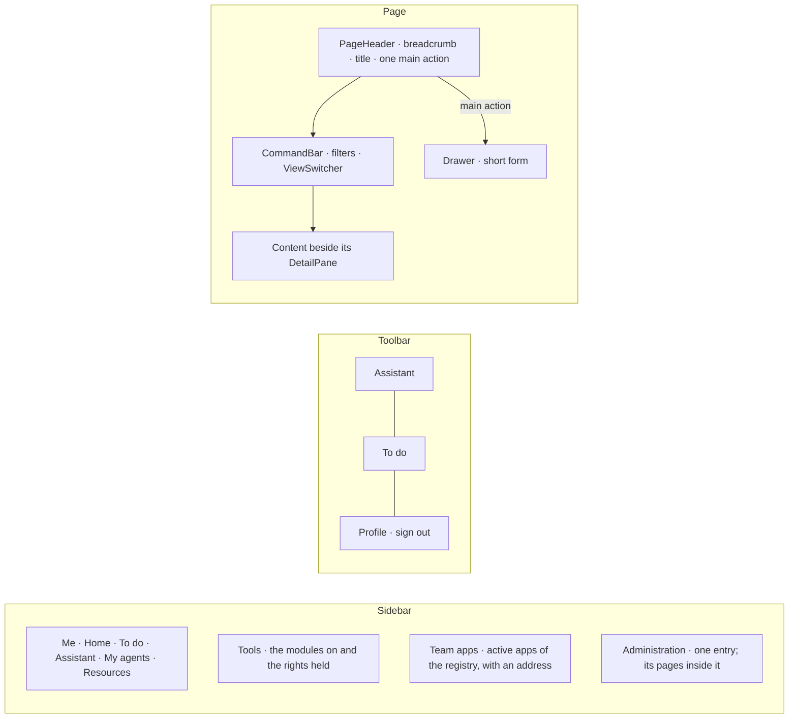

# Spec 016 — Every page in the same slots, every view in several formats

## Why

Pages invented their own layout; additions opened different interfaces in different places; a
view had one format (the organization only as a tree); agents lived in the Administration although
they act for a person; the team's apps were not in reach. kete-core spec 040 gives the workspace
design its slots (`PageHeader`, `Tabs`, `CommandBar`, `ViewSwitcher`, `SplitView`, `DetailPane`,
`DataTable`, `RowList`, `KpiGrid`, `OrgChart`, `Drawer`); this spec puts every screen in them.

## The frame

## User stories

1. **Same places.** Every page opens with its `PageHeader` (a breadcrumb inside the
   Administration or under a tool, the title, one main action at most); a short addition opens a
   `Drawer` and the list stays visible.
2. **Several formats.** The organization is a chart of positions (boxes and lines, holders,
   vacancies, folding), a tree of units, or a table of positions; actions are a list or columns
   (overdue, open, closed). The format is in the address (`?vue=`). Selecting a position opens it
   in the detail pane.
3. **Resources in one catalogue.** `/ressources` has a tab per kind (apps, skills, MCP, agents)
   with counts, pills per tier (all, mine, my team, the organization), a resource in the detail
   pane (owner, tier, card, address to copy, open the app, promote, read the card again, retire);
   « Register a resource » opens a side panel; the MCP tab gives the copilot's address.
4. **Agents where people work.** `/mes-agents` shows the agents acting for the person — hers and
   those of the positions she holds; the Administration keeps the overview.
5. **Team apps in reach.** `/v1/me` returns `apps`: the active apps of the registry she may see,
   with an address; the sidebar lists them under « Team apps ».

## Requirements

- **FR-001**: one sidebar for the whole application — Me, Tools, Team apps, Administration (its
  pages shown when one of them is open).
- **FR-002**: no page uses `PageTitle` any more; every page uses `PageHeader`.
- **FR-003**: every word comes from the catalogs (fr, en).
