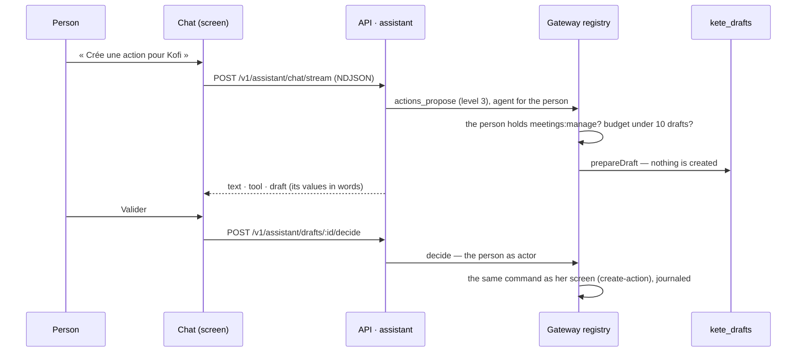

# Spec 017 — Agents prepare drafts, people decide; the assistant's chat to the usual standards

## Why

The autonomy scale (doctrine D-028, D-039) had levels 1 and 2 in Kete Enterprise only: an agent
read, signalled or did something reversible. Level 3 — prepare a decision a person validates —
existed in kete-core (`@kete/drafts`, `registry.review` and `registry.decide`) but not here. The
chat answered in one block, forgot its conversations, and could not stop.

## The flow of a draft

## User stories

1. **An agent prepares, a person decides.** `actions_propose` (an action of the register, needs
   `meetings:manage`) and `performance_propose_measure` (a review line from a reading, needs
   `performance:measure`) prepare drafts; `performance_readings_to_take` lists the readings
   matching lines still without a value, in the units where the person measures. Nothing exists
   until she validates; a refused draft stays refused; a decided draft cannot be decided again.
2. **Never more rights than her.** A business permission is held by the agent only where the
   person holds it (`reach`); a tool she may not use is not offered to her assistant.
3. **A budget of drafts.** At most 10 drafts wait for one person from her assistant; beyond, the
   agent is not allowed to prepare more until she decides.
4. **Drafts where she works.** In the chat, right under the answer; in « À faire », at the top.
   Each value shows where it comes from; identifiers are shown in words (a person's name, a
   review's holder and quarter, a reading's indicator, value and source).
5. **The chat to the usual standards.** Conversations kept and listed, one person each; the answer
   streamed and formatted (Markdown); each tool as a card with its state; copy, answer again;
   suggestions to start; a composer pinned at the bottom, Enter sends, Shift+Enter breaks the line,
   « stop » stops the model (what was said is kept).

## Requirements

- **FR-001**: migration `0016_drafts_and_conversations` — `kete_drafts` (@kete/drafts, frozen once
  decided) and `assistant_conversations`, `assistant_messages`, each with its RLS policy.
- **FR-002**: `POST /v1/assistant/chat/stream` answers `application/x-ndjson`: `conversation`,
  `text`, `tool` (with `draft`), `error`, `done`. The screens relay it at `POST /assistant/flux`
  (same origin only), adding the person's token server-side.
- **FR-003**: `GET /v1/assistant/conversations`, `GET /v1/assistant/conversations/:id` (404 for
  another person's), `GET /v1/assistant/drafts`, `POST /v1/assistant/drafts/:id/decide`.
