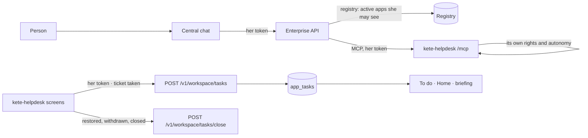

# Spec 018 — The team's apps integrate fully: their tools in the central chat, their tasks in To do

## Why

An app created with `pnpm create @kete-africa/app` (kete-helpdesk, the first) signed people in
with the Compte Kete, entered the registry by its identity card and sent its indicators as
readings (spec 015). But the central assistant could not use its tools, and what waited for a
person in it stayed there. « Each one can launch an app that integrates fully » asks for both.

## User stories

1. **The apps' tools in the central chat.** For each turn, the assistant asks every active app or
   MCP server of the registry the person may see (https address; her own personal ones included)
   for its tools, with her token; each tool is named after its app (`support__tickets_open`). Each
   app applies its own rights and autonomy: never more than hers. An app that does not answer
   within 4 s is left out of that turn. While an administrator views a demo person's space, no
   app is called — the token would be the administrator's.
2. **The apps' tasks in the one To do.** An app puts a task for the person whose token it holds:
   a title, an https address back into the app, a deadline. Sending it again (same app and key)
   updates it; closing it takes it out. Tasks show in « À faire » (« Dans vos apps »), overdue
   ones marked, and in the facts the briefing and `my_day` read.
3. **The helpdesk does it.** A ticket acknowledged, resumed or reopened is a task « Rétablir :
   … » for its holder, due at its criticality's deadline (suspensions added); restored, withdrawn,
   suspended or closed, the task leaves.

## Requirements

- **FR-001**: migration `0017_app_tasks` — `app_tasks` with its RLS policy; a task is read and
  closed by its person only (`user_id`).
- **FR-002**: `GET /v1/workspace/tasks`, `POST /v1/workspace/tasks` (201), `POST
  /v1/workspace/tasks/close`; an address that is not https is refused (422).
