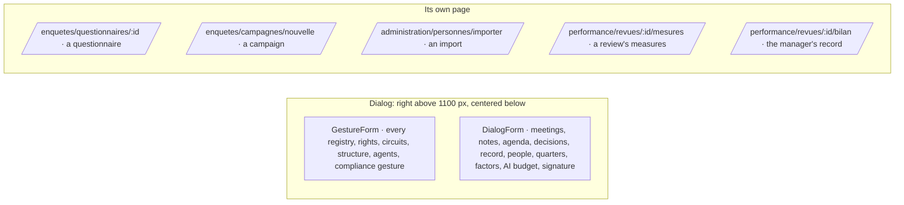

# Spec 019 — Every form on its page or in a dialog, and every mode

## Why

Decided with the author on 2026-10-03: « forms on their own page, or in a dialog — on the right
when there is room »; side panels that overflowed move to their pages; never a list and a form on
the same page. And the person chooses dark, light or automatic. Built on kete-core spec 044
(`Drawer`, `FormPage`, `ThemeChoice`, the theme cookie).

## Where each form went

- `GestureForm` (lib/forms) is now a button that opens its form in a dialog; on success the dialog
  closes and the page reloads. `DialogForm` does the same for a page's own gesture.
- The organization's drawing gestures are buttons in the page header; the registry's
  Administration page no longer holds the register form (it lives in Resources).

## Modes

The person chooses dark, light or automatic at the bottom of the sidebar; the choice is kept in a
cookie for a year and the server renders the page in it at once.

## Requirements

- **FR-001**: no page renders a list and a form side by side; a form is in a dialog or on its page.
- **FR-002**: every word from the catalogs (fr, en).
