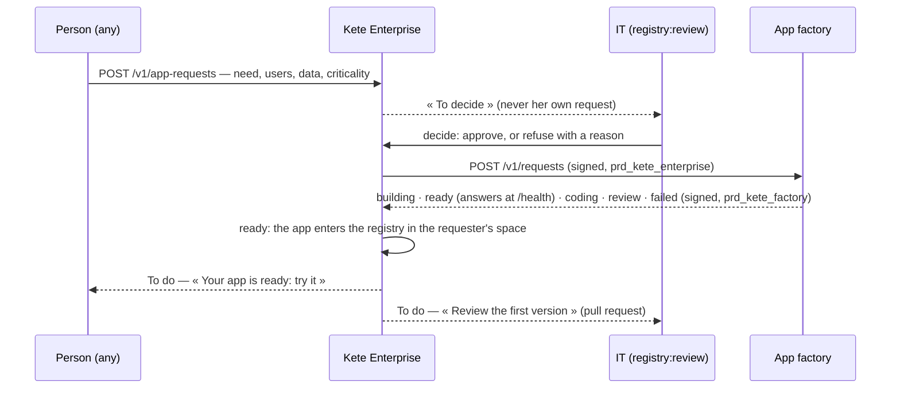

# Spec 021 — Asking for an app

## Why

« Each one can launch an app that integrates fully. » A person describes the app her team needs;
IT decides; the app factory (kete-core spec 048) creates it — repository, database, sign-in,
hosting — and a coding agent writes its first version in a sandbox, reviewed by a person. The app
then enters the registry in the space of the person who asked, and its tools reach the assistant.

## The flow

## Screens

| Address                           | What                                                                    |
| --------------------------------- | ----------------------------------------------------------------------- |
| `/ressources/demandes`            | Her requests; for IT, « To decide » and « All » tabs                    |
| `/ressources/demandes/nouvelle`   | The request, on its own page: the need, then the data and the stakes    |
| `/ressources/demandes/$requestId` | One request: where it stands; withdraw, approve or refuse (dialogs), send again |

## Requirements

- **FR-001**: anyone asks; the slug is unique in the organization; she withdraws it until decided.
- **FR-002**: only a holder of `registry:review` decides, never on her own request; a refusal
  carries a reason.
- **FR-003**: an approved request goes to the factory signed with the shared key; when the factory
  is absent or silent, the request waits and IT sends it again.
- **FR-004**: only the factory's signed reports change a request; a report sent again changes
  nothing more (one registry resource per request).
- **FR-005**: the news reaches the To do of whoever must act: the requester when the app is ready,
  the decider when the first version waits for review or the creation failed.

## Configuration

`FACTORY_URL`, `FACTORY_KID`, `FACTORY_SECRET` (≥ 32 bytes, shared with the factory),
`PUBLIC_API_URL` (the reports' callback), `PUBLIC_WEB_URL` (links in To do).
