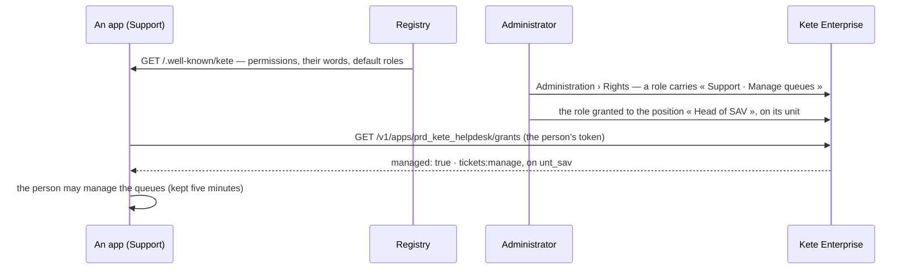

# Spec 022 — An app's permissions, granted here

## Why

An app's permissions were fixed per Compte Kete role (owner, admin, member): nobody could let the
head of after-sales service « manage the queues » of Support without a deploy. Each app now
declares its permissions in its identity card (kete-core spec 049); Kete Enterprise grants them
like its own, to positions, on a scope; the app reads what a person holds.

## The flow

## Rules

- **An app's permission** is carried by a role as `<product>#<permission>`
  (`prd_kete_helpdesk#tickets:manage`); a role refuses one that no active app of the registry
  declares.
- **Managed**: once a role of the organization carries one of an app's permissions, the app follows
  the grants; until then (`managed: false`), it keeps its own defaults.
- **Administrators** (owner, admin at the Compte Kete) hold every permission everywhere, the apps'
  included, as for Kete Enterprise's own.
- **An agent** never holds more than the person it acts for: the grants are hers.
- **Where**: a grant's scope (a unit and its subtree, a country, everywhere) comes back as units;
  an app that knows the structure applies it (spec 023).

## Screens

Administration › Rights: Kete Enterprise's permissions, then each app's from its card, with what
each allows; « Edit » on a role changes what it allows. A person's own rights list the apps' too.

## Requirements

- **FR-001**: `GET /v1/rights/permissions` gives Kete Enterprise's catalog and, by app, what each
  active app declares.
- **FR-002**: `GET /v1/apps/:product/grants`, with the person's token, gives `managed` and what she
  holds for the app, and where; an unknown app answers `managed: false`.
- **FR-003**: a role refuses an app permission no active app declares (`unknown_permission`).
