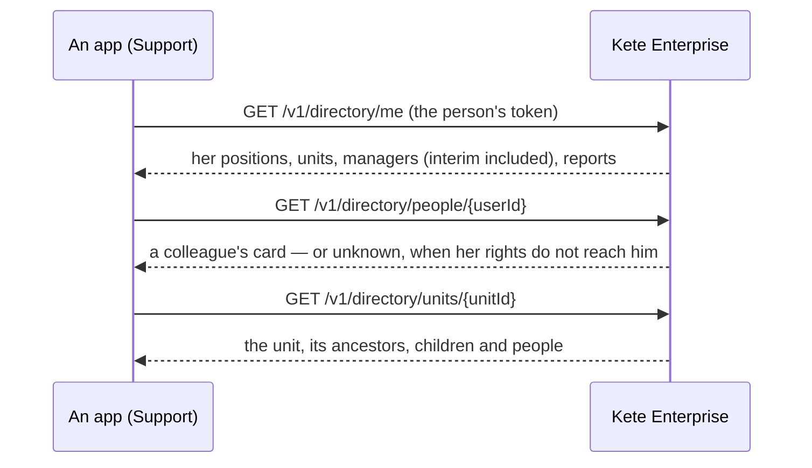

# Spec 023 — The directory and the approvals, for the team's apps

## Why

An app needs to know the organization — who someone's manager is, which unit a team belongs to —
and to have a request approved by the right person. Without the center, each app would copy the
organization chart and rebuild Frappe's workflows. Kete Enterprise already knows the structure
(spec 002), the rights (spec 003) and the circuits (spec 005): it answers the apps.

## Part 1 — the directory

- **What it shows**: names, work e-mails, Compte Kete accounts, positions and units. Never a phone
  number.
- **Who sees whom**: a person sees herself, her managers and her reports; a colleague or a unit
  beyond that needs « structure:read » over it; a unit she belongs to is hers to see. Whatever she
  may not see answers as unknown (404), never as forbidden.
- **At a date**: `?asOf=YYYY-MM-DD`; interim and delegation count as holding the position.

## Part 2 — approvals (with kete-core spec 049, part 4)

An app declares the subjects it asks decisions for in its card (`subjects`); it opens a request at
the center with the person's token; the decisions engine finds the approver by the structure and
the thresholds, interim included; the person decides in the Inbox; the center tells the app, which
reads the outcome with its own token.

## Requirements

- **FR-001**: `GET /v1/directory/me`, `/people/:userId`, `/units/:unitId` answer under the rules
  above, at today's date or `asOf`.
- **FR-002**: nothing the person may not see is told to exist.
