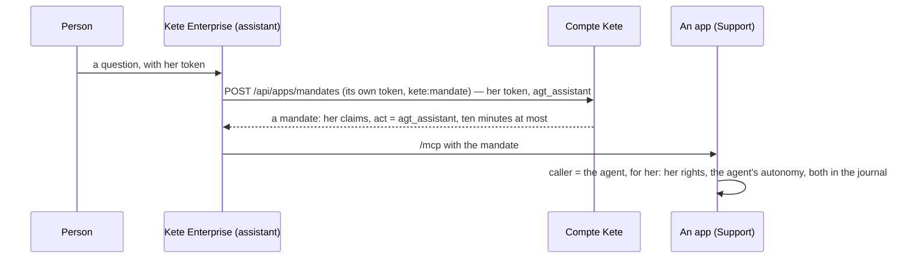

# Spec 024 — An agent's mandate

## Why

The assistant and the agents of Kete Enterprise call the team's apps for a person. With her own
token, an app could not tell an agent from her: it could not prepare a draft instead of acting, and
its journal said she did what an agent did. They now carry a **mandate** (kete-core spec 049).

## The flow

## Rules

- **On by configuration**: `KETE_MANDATES=on`, with Kete Enterprise's client holding
  `kete:mandate`. Off, the person's token goes as before.
- **No mandate, no call**: when mandates are on and the Compte Kete refuses one, the apps are
  left out of that turn — an agent never passes for the person.
- **Never more than the person**: the mandate carries her claims only.
- **Not while viewing as**: in a demo organization, an administrator viewing a person's space
  never lends the apps (spec 018).

## Requirements

- **FR-001**: `appToolsFor` asks the apps' tools with the mandate of `agt_assistant` when mandates
  are on.
- **FR-002**: without a mandate, no app is called.
