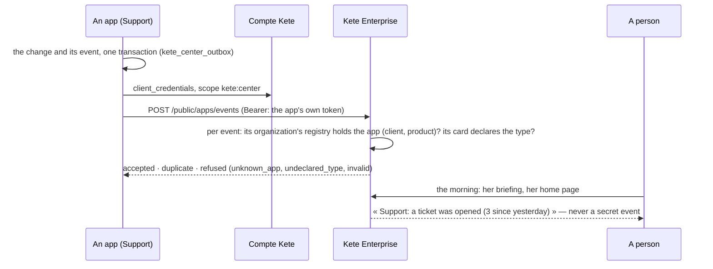

# Spec 025 — The apps' events

## Why

Until now an app told Kete Enterprise nothing unless it put a task in someone's To do: agents and
briefings would have had to ask every app, again and again. An app now announces what happens —
« a critical ticket opened » — and Kete Enterprise keeps it for the people it concerns.

## The flow

## Rules

- **The app's own token** (`kete:center`), never a person's: an event is a fact of the app.
- **Its organization's registry** must hold the app, by the client id and product of its card; a
  type the card does not declare (`emits`) is refused.
- **Once**: an event delivered again is a `duplicate`, nothing more.
- **Facts and identifiers only** (`event.v1`): whoever wants the rest reads it at the app's API,
  under her own rights.
- **Who hears of it**: the people whose registry shows the app and, once its rights are managed
  here (spec 022), who hold something in it. A `secret` event never reaches a briefing nor a model.

## Requirements

- **FR-001**: `POST /public/apps/events` takes at most 100 events, with an app's token carrying
  `kete:center`, and answers one outcome per event (`delivery-result.v1`).
- **FR-002**: `app_events` keeps each event once, under its organization's row-level security.
- **FR-003**: the workspace's facts carry `appNews`, counted by app and type over the last day,
  without secret events; the briefing by rules tells the first three.
