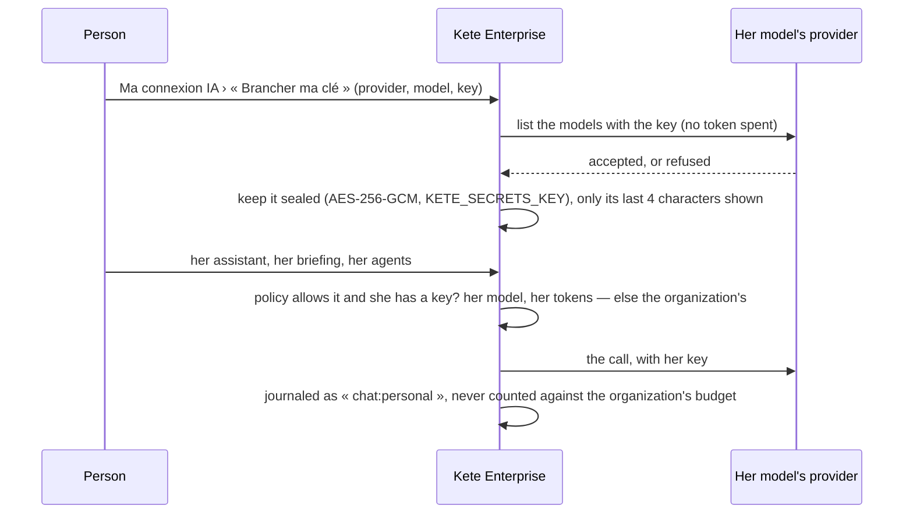

# Spec 026 — Each person's own AI connection

## Why

In a company, whoever launches her assistant and her agents may want them to run on her own
tokens: her own subscription, her own budget, her own choice of model. The organization decides
whether it allows it, requires it, or pays for everyone.

## The flow

## Rules

- **The organization's policy** (Administration › IA): `allowed` (her key if she brought one,
  otherwise the organization pays — the default), `required` (her key only; without one, her
  assistant does not answer), `off` (the organization pays for everyone; no personal key).
- **The key** is tried once on its provider before it is kept; sealed at rest; never returned nor
  logged; only its last four characters show. She replaces or removes it at any time; an
  administrator viewing her space as her never touches it.
- **Who pays shows**: the usage journal tells « personal tokens » apart; the organization's
  monthly budget counts only what it pays for.
- **Later**: when OpenAI opens « Sign in with ChatGPT » plan usage to hosted apps, it becomes a
  third way to connect, behind the same connection; for agents in a sandbox, her key goes to her
  sandbox only.

## Requirements

- **FR-001**: `GET /v1/ai/connection` gives the policy, whether the instance keeps secrets, and
  her connection without its key; `POST /v1/ai/connection` tries and keeps it;
  `POST /v1/ai/connection/remove` removes it.
- **FR-002**: `POST /v1/ai/policy` (administrators) sets `off`, `allowed` or `required`.
- **FR-003**: the assistant, the briefing and the chat answer her on her own model when the policy
  allows it and she has a key.
