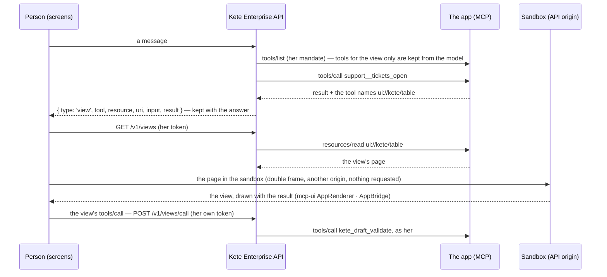

# Spec 029b — The team's apps' views in the chat (MCP Apps)

## Why

Doctrine D-037: an app comes to the person when she needs it, without her opening it. When the
assistant calls an app's tool that names a view (`ui://…`), the chat shows that view with the
result — a table of tickets, a record, a form, a draft to decide — and the person acts in it. The
model prepares; in a view, she decides.

## The flow

## Rules

- **Existing solutions**: the host is mcp-ui's `AppRenderer` (MCP Apps' `AppBridge`); the sandbox
  proxy is adapted from the MCP Apps reference host. Kete Enterprise adds only its routes and its
  design around them.
- **The model never decides in a view**: a tool whose `_meta.ui.visibility` leaves out `model`
  (deciding a draft) is never given to the model; only the view calls it, through the API, with the
  person's own token — her gesture, never her agent's.
- **Isolation**: the view runs in a double frame on the API's origin, under a policy that lets it
  request nothing (`connect-src 'none'`) and be framed only by the screens.
- **Hers only**: a view is read, and its calls relayed, only for an app of the registry she may
  see; never while an administrator views her space.
- **Kept**: the views shown with an answer are kept with it, and shown again when she reopens the
  conversation.

## Requirements

- **FR-001**: `appToolsFor` keeps each tool's view and leaves out the tools for the view only.
- **FR-002**: the stream sends `{ type: 'view', … }`; `assistant_messages.views` keeps them
  (migration `0025_assistant_views`).
- **FR-003**: `GET /v1/views?resource&uri` (the page), `POST /v1/views/call` (a view's call), `GET
  /views/sandbox` (the proxy, public, its own policy).
- **FR-004**: the chat shows the view under its tool's card; `PUBLIC_API_URL` names the API as
  browsers reach it (`API_URL` by default).

## Next

The home page shows an app's views too (kete-core spec 050); an app's own page asking for other
origins (`_meta.ui.csp`) waits until one needs it.

## Proof

« Les tickets ouverts ? » — Support's table shows in the chat; a draft prepared through Support is
validated by the person in its view, never by the model.
