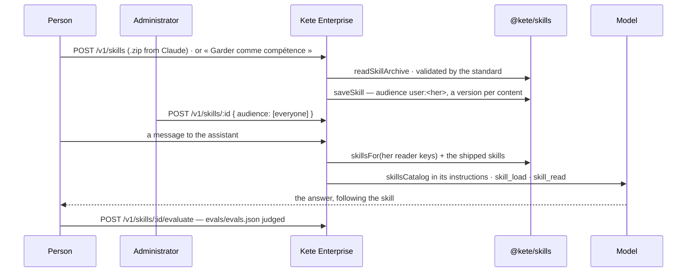

# Spec 031 — Skills

## Why

« Write to a client the way we write. » In 2026 know-how reaches a model as **Agent Skills**
(agentskills.io): a folder whose `SKILL.md` says what it does, when to use it and how. A skill made
in Claude, ChatGPT or Codex works here, and one kept here goes back there. Kete Enterprise ships
its own — the chat's commands, until now written in the code — and each organization keeps its
own: brought as a .zip, or kept from a conversation that worked; opened to others by an
administrator; versioned; checked against its own test cases. Built on `@kete/skills` (kete-core
spec 054).

## The flow

## Rules

- **Shipped skills** live in `apps/api/skills/<name>/SKILL.md`; a chat command reads the
  instructions of the shipped skill whose `metadata.kete-command` names it. Their names are not
  the organization's to take.
- **A kept skill is its author's** until an administrator opens it to others (`everyone`, units);
  its author switches it off, brings a version back, removes it. Another person cannot take its
  name.
- **The assistant reads progressively**: names and descriptions first, a skill's instructions when
  it uses it, a reference file when the instructions point to it. Skills only read: level 1.
- **Every version is kept**; a skill is exported as the .zip Claude and ChatGPT take.
- **Kept from a conversation**: the model writes a general `SKILL.md` from it, validated by the
  standard; it is hers alone.
- **Off by default** (`skills` module) for the organization's skills; the shipped ones always work.
- Scripts of a skill run only in a provider's sandbox (`@kete/ai` `hostedShell`); none is run here.

## Data

`kete_skills`, `kete_skill_versions` (`@kete/skills`), each with its row-level security, migration
`0031_skills`.

## Interface

- **Compétences** (`/competences`): the organization's skills (export, test, switch off, remove;
  open to everyone for administrators), the shipped ones; « Ajouter un .zip ».
- **The assistant**: « Garder comme compétence » on a conversation.

## Proof

`apps/api/tests/skills.test.ts`.
