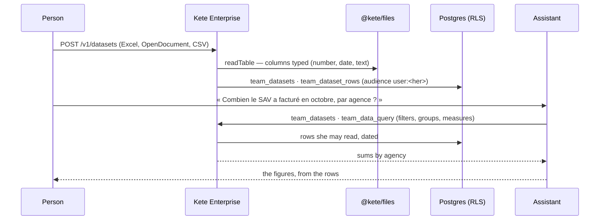

# Spec 031b — Team data

## Why

« What did the SAV bill in October, by agency? » Teams keep their figures in spreadsheets. Kete
Enterprise keeps them as rows — typed, described as the apps' data sets are (dataset.v1: a time
field, measures, dimensions) — read by the people their audience opens them to, and summed up by one
small query for the screens, the assistant and, next, the dashboards (spec 033). The assistant's
figures then come from the rows, never from its head. Built on `@kete/files`' `readTable`
(officeparser) and Postgres.

## The flow

## Rules

- **Hers until opened**: a table brought is its owner's alone; an administrator opens it to
  others (`everyone`, units). Its owner replaces its table or removes it.
- **Typed once**: the first row names the columns; numbers in French or English notation, days,
  texts; the first date column dates the rows, numbers are measures, texts dimensions.
- **One query**: filters (`eq`, `neq`, `gte`, `lte`, `contains`), up to three groups, up to six
  measures (`count`, `sum`, `avg`, `min`, `max`) over at most 50 000 rows; only its own columns.
- **The assistant reads, level 1**: `team_datasets`, `team_data_query`, within her audience.
- 20 MB and 50 000 rows at most a table; off by default (`datasets` module).

## Data

`team_datasets`, `team_dataset_rows`, each with its row-level security, migration
`0034_team_datasets`.

## Interface

- **Données** (`/donnees`): her teams' data, « Déposer un tableau ».
- **A data set** (`/donnees/$datasetId`): its columns and their types, its first rows; for its
  owner or an administrator, a new version, opening it, removing it.

## Proof

`apps/api/tests/datasets.test.ts`.
