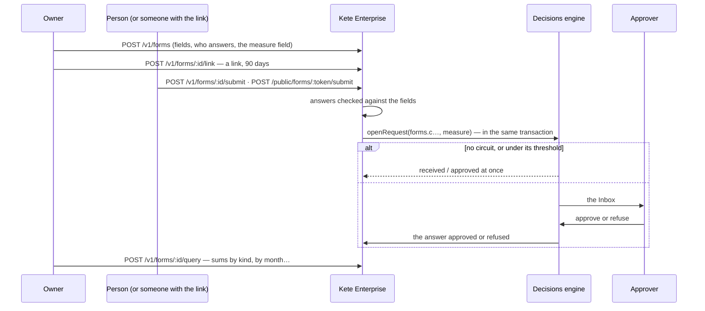

# Spec 032 — Forms

## Why

« An expense claim, approved by my manager above 50 000 FCFA. » Many of a company's small processes
are a form and an approval: expenses, requests, registrations. Kete Enterprise lets anyone build one
in a few fields, answered in the space or by a link without an account; each answer goes through the
circuit an administrator defines for it, from a threshold; and the answers are read as data — by the
same query as a team's tables (spec 031b), for the person who runs it and for her assistant. Built
on what exists: the decisions engine (spec 005), the personal links (spec 010), team data's query.

## The flow

## Rules

- **Fields**: short or long text, number, date, one choice among options, yes or no; required or
  not; each answer checked, nothing else kept. A yes or no reads as 1 or 0 in the data.
- **Who answers**: the people of the organization (in the space), or only those holding its link
  (without an account); a closed form takes no answer and its link stops.
- **A circuit per form**: each form is a subject of the decisions engine (`forms.c…`, named after
  the form on the circuits' screen); its measure field feeds the thresholds. Without a circuit, an
  answer is received.
- **Who sees what**: its owner (or an administrator) sees every answer and runs it; a person sees her
  own answers.
- **The assistant reads**, level 1: `form_answers_query` on the forms she runs.
- Off by default (`forms` module). Next: a recurring form becomes an app (the factory).

## Data

`form_collections`, `form_submissions`, each with its row-level security, migration `0035_forms`.

## Interface

- **Formulaires** (`/formulaires`): to fill in, those she runs, « Nouveau formulaire » (fields,
  who answers, the amount the circuit reads).
- **A form** (`/formulaires/$id`): fill it in; its answers with their status; its link; close or
  reopen.
- **A link** (`/lien/:token`): the form, her name, send.

## Proof

`apps/api/tests/forms.test.ts`.
