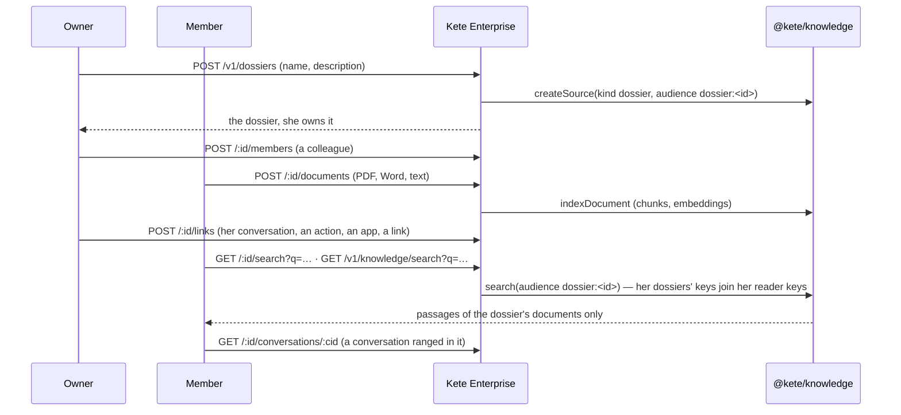

# Spec 034 — Dossiers

## Why

« Everything about the ISO audit, in one place. » Work runs by subject — the ISO audit, the monthly
SAV review, a client's tender — and its pieces live everywhere: documents, conversations with the
assistant, actions, decisions, apps. A dossier is one space per subject, shared by the people who
work on it: its documents, read by its members only and searched in the dossier or in the library,
and what it gathers from the rest of Kete Enterprise by reference, never by copy.

## The flow

## Rules

- **Anyone opens a dossier and owns it.** Never while an administrator views her space.
- **Its owner decides**: who is a member, its name, its archive. A member may leave; the owner
  never is removed.
- **Its documents are read by its members only**: they form a library source whose audience is
  `dossier:<id>`; the dossiers she belongs to add that key to her reader keys, so the library's
  search and the assistant's find them for her and never for anyone else.
- **What it gathers is a reference** (`conversation`, `action`, `decision`, `app`, `url`), unique by
  kind and reference. A conversation is ranged only by its author; once ranged, the dossier's members
  read it through the dossier.
- **Not a member, not there**: a dossier she is not a member of answers 404, as if it did not exist.
- **Off by default**: the `dossiers` module is turned on by the organization; its documents need the
  `knowledge` module's embedding model (409 `knowledge_unavailable` otherwise).
- **Words** from a catalog (French, English), never hard-coded.

## Data

| Table             | Holds                                                                  |
| ----------------- | ---------------------------------------------------------------------- |
| `dossiers`        | name, description, its library source, its creator, archived or not    |
| `dossier_members` | who, with her name and role (`owner`, `member`)                        |
| `dossier_links`   | what it gathers: kind, reference, title, address (`/…` or `https://…`) |

All three carry the organization's row-level security policy, in the migration `0029_dossiers`.

## Interface

- **Dossiers** (`/dossiers`): her dossiers, the open ones first; « Nouveau dossier ».
- **A dossier** (`/dossiers/$dossierId`): its documents (add, remove) and their search; what it
  gathers (add a link, remove); its members (the owner adds and removes, a member leaves); archive.

## Proof

`apps/api/tests/dossiers.test.ts`: the module gate; the owner and her members, an outsider sees
nothing; a member's document found in the dossier and in her library, never by an outsider; a
conversation ranged only by its author and read by the members; the archive by the owner only, a
member leaving.
