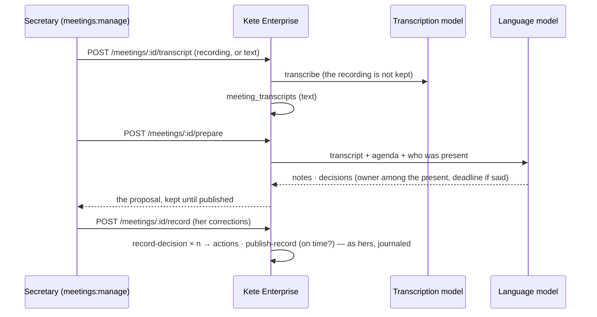

# Spec 035 — Meeting records

## Why

« The weekly review's record prepared, the decisions with their owners. » A meeting's record is
written by someone who also took part: late, partial. Kete Enterprise prepares it from what was
said — the recording transcribed, or the transcript pasted — and the person who runs the meeting
corrects it and publishes it. Its decisions go through the same commands as by hand: each with an
owner and a deadline becomes an action in the register, the record counts on time or late, the ISO
evidence follows. Built on the AI SDK's transcription and structured output through `@kete/ai`.

## The flow

## Rules

- **For who runs meetings** (`meetings:manage`), never while viewing another person's space.
- **The recording is not kept**: only its transcript, under the organization's row-level security;
  25 MB at most.
- **The model proposes, the person decides**: an owner only among those present, a deadline only
  one that was said; nothing is recorded until she publishes, through the same commands as by hand.
- **Models are configuration**: `KETE_TRANSCRIPTION_*`, or the organization's provider when it
  transcribes; 409 `transcription_unavailable` / `assistant_unavailable` otherwise. Their use is
  journaled (purpose `meetings`).

## Data

`meeting_transcripts` (text, source, language, the proposal), migration `0033_meeting_records`.

## Interface

A held meeting's page: « Préparer le compte rendu » — upload the recording or paste the
transcript, « Proposer le compte rendu », correct the notes and each decision, « Enregistrer les
décisions et publier ».

## Proof

`apps/api/tests/meeting-records.test.ts`.
