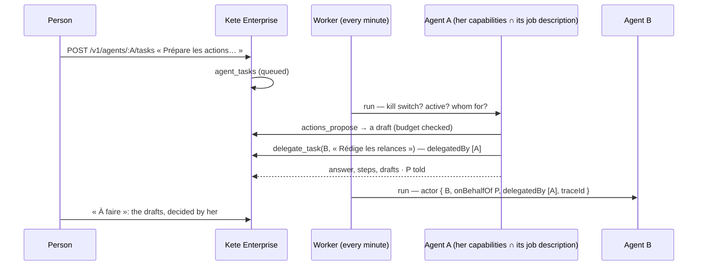

# Spec 036 — Agents: tasks given, handed on, supervised

## Why

« Prepare the actions of yesterday's review, and have the follow-up letters written. » A person
gives one of her agents a task; it works in the background — her capabilities, narrowed to its job
description — and every commitment becomes a draft she decides; it may hand part of the work to
another of her agents; she sees each task, its steps, its drafts, and is told when it ends; she
stops a task, and an administrator stops every agent at once. Built on what exists: the AI SDK's
tool loop through `@kete/ai`, the capability registry and its drafts (`@kete/capabilities`), the
delegation chain of `@kete/commands` (D-039), pg-boss. No other agent framework: it would duplicate
these.

## The flow

## Rules

- **Given by its person** (or who manages agents), to an active agent; never while viewing
  another person's space.
- **Her rights, narrowed**: the capabilities her rights allow, then only those whose permission
  its job description lists, up to its highest autonomy level; a level 3 or 4 capability prepares a
  draft, within its budget of open drafts — beyond it, it waits for her decisions.
- **Handed on**: to another active agent of the same person, never to one of its own chain, at most
  four agents deep (`MAX_DELEGATION_DEPTH`); every gesture carries the chain and its trace.
- **Supervised**: each task keeps its answer, its steps (tool and outcome), its drafts; its person is
  told when it ends (`agent.task`); she stops a queued or running task.
- **The kill switch**: a paused agent, or the `agents` module switched off, runs nothing.
- **Models are configuration**: the organization's model; its use journaled as the agent's
  (purpose `agents`).

## Data

`agent_tasks`, with its row-level security, and the definer `agent_tasks_queued()` (identifiers
only, for the worker), migration `0037_agent_tasks`.

## Interface

**Mes agents**: on each agent, « Confier une tâche », its latest tasks with their status, answer
and drafts to decide in « À faire », « Arrêter ».

## Proof

`apps/api/tests/agent-tasks.test.ts`.
