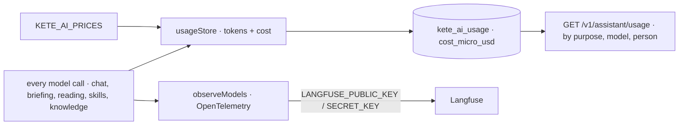

# Spec 037 — Production

## Why

KYA works on production: its own domain and server, backups, monitoring, real e-mails. This spec
grows with each part; its first part is **knowing what the models cost and do**.

## Part 1 — Model costs and traces

- Every call is journaled through one store (`platform/usage.ts`) with its cost when
  `KETE_AI_PRICES` gives the model's price (US dollars per million tokens); migration
  `0032_ai_costs`.
- The administrators' usage report gives each purpose's cost and the lines by model and person.
- `observeModels()` at start-up traces every call to Langfuse when configured; prompts and answers
  stay out unless `KETE_AI_TRACE_CONTENT=true`.

Proof: `apps/api/tests/costs.test.ts`.

## Next parts

The domain, the server, backups, monitoring, real e-mails, WhatsApp.
