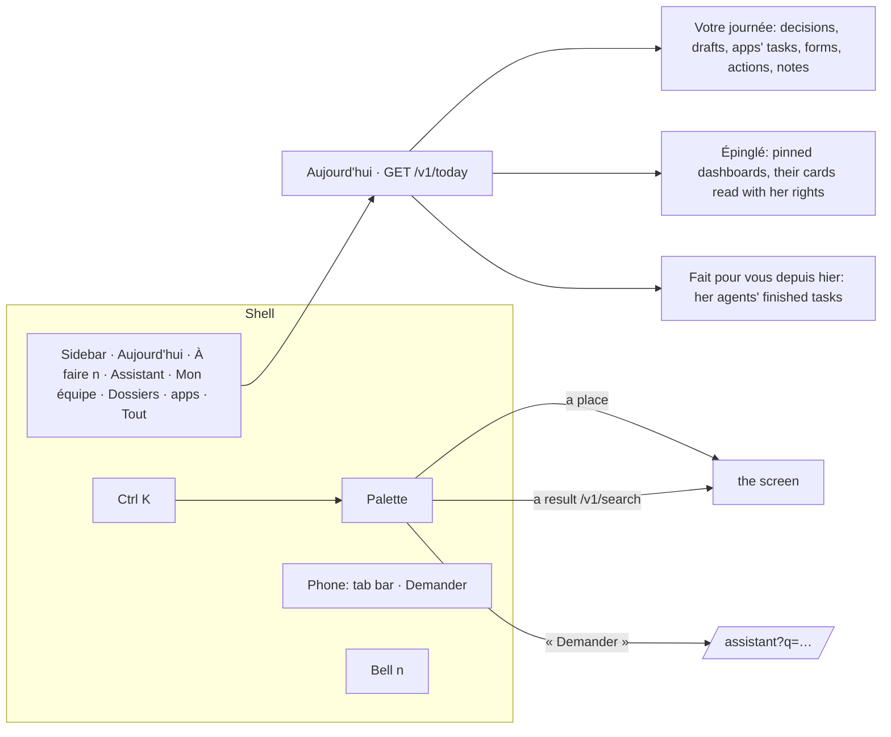

# Spec 046 — The Kete 2026 shell and « Aujourd'hui »

## Why

The space had grown a long sidebar of tools and a home page of counts. A person opens Kete to know
what to do now and to do it. The shell keeps five places in sight — Aujourd'hui, À faire (with what
waits), Assistant, Mon équipe, Dossiers — her team's apps, then « Tout » for everything else; one
field, Ctrl K, goes anywhere, finds anything she may read, or asks the assistant. On a phone, a bar
of tabs with « Demander » raised in the middle. « Aujourd'hui » turns the briefing into things to
do, each with the gesture that settles it; shows the views she pinned, up to date; and says what her
agents did for her since yesterday.

Built on what exists: `cmdk` for the palette (through `@kete/design` 0.6.0), the decisions engine,
the drafts of `@kete/capabilities`, the apps' tasks, the surveys, the actions register, the
meetings' notes, the dashboards (spec 033) and the agents' tasks (spec 036).

## The screens

## Rules

- **What waits** (`GET /v1/today`, and `waiting` in `/v1/me`): the decisions she may take, the
  drafts prepared for her, the open tasks the apps put in her To do, the forms she has not
  submitted, her open actions, the decision notes she has not read — read with her rights;
  overdue first, then in that order, then by due date. « Aujourd'hui » shows six; the rest wait in
  « À faire ». A draft is validated right there; everything else opens where it is settled.
- **Pinned views**: she pins a dashboard she may read (`POST /v1/dashboards/:id/pin`); it shows on
  her « Aujourd'hui » with its cards' figures read with her rights; a dashboard closed to her since
  stays pinned and unseen. Pins are hers alone (`dashboard_pins`, migration 0038, RLS by
  organization, filtered by user). Never while viewing another person's space.
- **Done for her**: the tasks her agents finished (done or failed) in the last 24 hours, their
  answer and the drafts they left; none while viewing another person's space.
- **Ctrl K**: places her modules and rights open, her apps, the Administration when she holds part
  of it; results of the global search (spec 030) as she types; « Demander » opens the assistant
  with the question, sent once.
- **The bell** counts her unread notifications.

## Proof

- `tests/dashboards.test.ts`: a pinned dashboard shows on her « Aujourd'hui » with its figures,
  hers alone; another person cannot pin what she may not read; unpinned, it leaves.
- `tests/agent-tasks.test.ts`: a task finished by her agent shows on her « Aujourd'hui », its draft
  among the things to do, counted beside « À faire »; nothing of it for another person.
- `@kete/design` 0.6.0: the palette, the tab bar and the counts on semantic tokens only.
