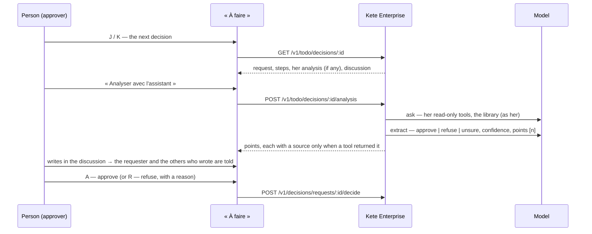

# Spec 047 — « À faire »: decide beside the list

## Why

The To do page stacked sections — drafts, apps' tasks, forms, notes, actions, decisions — each
with its own form. A person goes through what waits one thing after the other: the list on the
left, the thing in full on the right, the gesture under it, the next one with a key. A decision
comes with what helps to take it: the assistant's analysis with its sources, its steps, its facts,
and the discussion of the people it concerns. The assistant never decides: it reads with her
rights and says what it found; she decides.

Built on what exists: « Aujourd'hui »'s list of what waits (spec 046), the decisions engine (spec
005), the drafts and their cards (spec 017), `@kete/ai` (`ask` with the person's read-only
capabilities and the library's search, then `extract` into a fixed form), the notifications (spec
030), the agents' tasks (spec 036).

## The flow

## Rules

- **The list**: « À décider » (decisions, drafts) then « À compléter » (apps' tasks, forms,
  actions, notes), each ordered as on « Aujourd'hui »; `/a-faire?item=kind:id` opens one.
- **Keys**: J and K move; A approves a decision or validates a draft; R refuses (a decision asks
  its reason in a dialog); C gives an app's task, a form, an action or a note to one of her
  agents (spec 036). Never a key while she types.
- **A decision is read** by its requester, whoever may decide its current step, whoever decided
  one of its steps, and an administrator; by nobody else (404).
- **The analysis** is hers alone, kept until she asks again. It reads only (capabilities of level
  1, the library she may read), never prepares nor commits. A point cites a source only when a
  tool returned it — the model cannot invent one; without a single verified source the confidence
  is never « high ». Without a model: 409 `assistant_unavailable`.
- **The discussion**: whoever reads the decision writes (never while viewing another person's
  space); the requester and the others who wrote are told, with a link to it. Tables
  `decision_analyses` and `decision_comments`, migration 0039, RLS by organization.
- **Her requests** stay under the list, with their state.

## Proof

- `tests/todo.test.ts`: read in full by whoever it concerns, decided by its approver only, 404 for
  others; analysed for her, a point without a returned source has none and the confidence falls
  to medium; hers alone; 409 without a model; the discussion tells the others, refuses an outsider
  and an empty message.
