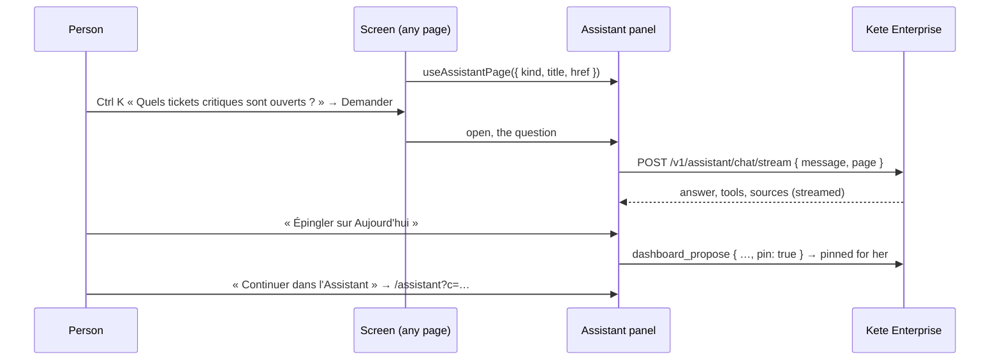

# Spec 048 — The assistant beside the page, Ctrl K that answers

## Why

A question comes while looking at something: a decision, a dashboard, a dossier. Leaving the page
for the assistant loses what she was looking at. The assistant opens beside every screen — the
sparkle of the toolbar — knows the page (« Je vois : … »), answers with its sources, and keeps the
conversation for the assistant's page when she wants more room. A question typed in Ctrl K is
answered there, in place. From an answer, one gesture makes it last: pinned on « Aujourd'hui » as
a view, or asked again every Monday.

Built on what exists: the chat (spec 027, assistant-ui, `useKeteChat`), its tools and sources,
the dashboards' proposal (spec 033) and pins (spec 046), the scheduled tasks (spec 029).

## The flow

## Rules

- **What the page shows**: a page declares its kind, title and address (`useAssistantPage`); the
  stream adds them to the model's instructions, nothing else. À faire declares the selected thing,
  a dashboard and a dossier themselves.
- **The panel** never changes the address; a question from Ctrl K starts a new conversation,
  found again in the assistant's list. Escape closes it. On the assistant's page, Ctrl K's
  question goes to its own thread.
- **Pinning** from an answer: the assistant proposes a dashboard and pins it at her word (`pin`
  in `dashboard_propose`, level 2: a proposal she keeps or removes, a pin she takes off).
- **Every Monday**: the assistant's scheduled task (spec 029), as she would ask it.

## Proof

- `tests/dashboards.test.ts`: a dashboard proposed with `pin` shows on her « Aujourd'hui ».
- `tests/chat.test.ts`: the stream still answers; `page` is optional.
