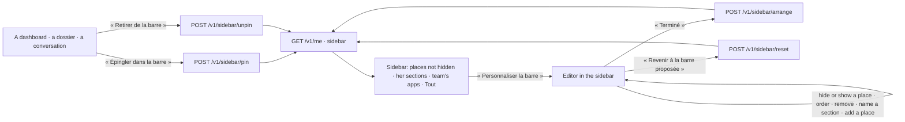

# Spec 049 — The sidebar each person arranges

## Why

Each person works with her own few things: a dashboard she reads every morning, the dossier of
her audit, a conversation she comes back to. The sidebar of spec 046 was the same for everyone.
Now Kete proposes it — Aujourd'hui, À faire, Assistant, Mes agents, Dossiers, Tableaux de bord,
Mon équipe, Ressources, as her modules open them — and she arranges it: she hides a place she
does not use, pins what she reads from where it lives, groups her shortcuts in sections she names,
orders them. It is kept with her account, so it follows her on every device.

Built on what exists: the shell and its places (spec 046), `@kete/design` 0.6.0's navigation.

## The screens

## Rules

- **Hers alone**: one layout per person (`sidebar_layouts`, migration 0040, RLS by organization,
  read by her user). Never changed while an administrator views a demo person's space.
- **What it holds**: the places she hides (never « Aujourd'hui » nor « À faire »); up to 8
  sections, each with an optional name (none: « Épinglés ») and up to 30 shortcuts.
- **A shortcut** names its kind — a place, a dashboard, a dossier, an agent, a conversation, a
  team's app, a link — its reference and its label. A link is a path of the space, never another
  site nor a script. A shortcut only leads somewhere: the page it opens checks her rights; a
  place her modules no longer open, or an app she no longer reaches, is not shown.
- **Pinning** adds the shortcut to her first section, once; unpinning removes it wherever it is.
- **Arranging** keeps the whole layout at once, when she presses « Terminé »; « Annuler » leaves
  it as it was; « Revenir à la barre proposée » forgets it.
- Pinning a dashboard on « Aujourd'hui » (spec 046) stays a separate gesture.

## Proof

- `tests/sidebar.test.ts`: the proposed sidebar comes with `/me`; a shortcut is pinned once and
  unpinned; sections, their order and hidden places are kept, « Aujourd'hui » never hidden; a
  colleague and another organization see nothing of it; a link to another site or a script is
  refused; reset goes back to the proposed sidebar.
