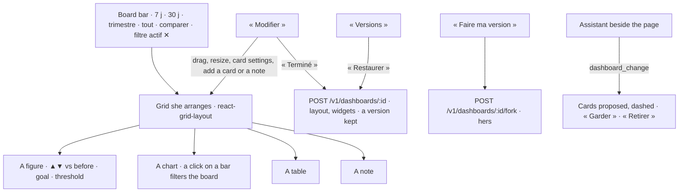

# Spec 050 — Dashboards as personal as their reader wants

## Why

A dashboard of spec 033 was a list of up to twelve cards, composed once. A person reads hers
every morning and wants it her way: the important figure larger and first, the last 7 days or the
quarter, one site at a time, the figure compared with the period before, a goal to reach, a line
of her own for the committee. When a dashboard is shared, each reader wants it her way without
changing it for the others. And she wants to ask the assistant « ajoute les pièces en rupture »
rather than fill a form.

Built on what exists: the dashboards and their small queries read with each reader's rights
(spec 033), the pins (spec 046), the assistant beside the page (spec 048); the grid on
`react-grid-layout` v2 (the grid of Grafana, Metabase, Kibana), the charts on Apache ECharts 6.

## The screens

## Rules

- **The grid**: each card has a stable id and a place (x, y, w, h on 12 columns); the owner moves
  and resizes them in « Modifier »; on a phone the cards follow one another in the same order.
- **The board's filters** are the reader's, not saved: a period (7 days, 30 days, the quarter,
  everything) dates every card on its source's time column; « Comparer » reads the period before
  too, and a figure shows its rise or fall, coloured by whether up is good; a click on a bar sets
  the board's filter « column = value », applied to every card whose source has that column, the
  others say they are not filtered.
- **A card** may carry a goal (a value, and whether higher or lower is better) and a threshold;
  a figure over its threshold says so. Cards are data cards (spec 033) or notes (a title, a text).
- **Versions**: every change by its owner keeps the previous state (`dashboard_versions`,
  migration 0041, RLS); she restores one — the current state becomes a version in turn.
- **Her version**: a reader of a shared dashboard makes her own copy (« Faire ma version »); it
  remembers its original; the original never changes.
- **The assistant** changes a dashboard its person owns (`dashboard_change`, level 2): it adds
  cards marked proposed, removes or renames a card, changes its view, its goal or its threshold;
  every change is a version, so « Annuler » restores it. A proposed card is kept or removed by her.
- Reading stays as in spec 033: each card with the reader's rights; a card she may not read says
  so and shows nothing.

## Proof

- `tests/dashboards.test.ts`: a card's place, goal and threshold are kept; a period dates the
  cards, « comparer » brings the period before; a board filter narrows the cards whose source has
  the column and leaves the others; a change keeps a version and restoring it brings it back; a
  reader makes her version, the original unchanged; the assistant adds a proposed card to her
  dashboard, never to one she does not own; a note is kept and read.
