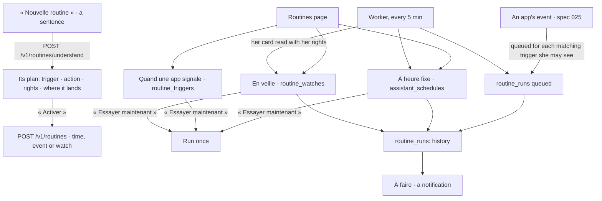

# Spec 051 — Routines

## Why

A person wants things to happen without her: the late tickets every Friday at four, a word when
an app signals a critical ticket, a warning when a figure she watches goes over its line. Kete
had the first (the scheduled tasks of spec 029, under the assistant), and pieces of the others
(the apps' events reached only the morning briefing; a dashboard's threshold, spec 050, only
showed). Now one page, « Routines », holds the three families, in her words:

- **À heure fixe**: every day, every working day, every week, at a time.
- **Quand une app signale**: when an app of her team announces an event of a type it declares.
- **En veille**: when a figure of a dashboard she reads goes over its threshold.

She writes it in a sentence; Kete understands it and shows its plan — what will trigger it, what
it will do, with which rights, where the answer lands — before anything starts. She tries it once.
Each run is kept: when, what triggered it, how it went.

Built on what exists: the scheduled tasks and their worker (spec 029), the apps' events
(spec 025), the dashboards' cards read with her rights (spec 050), the notifications (spec 030),
`@kete/ai`'s structured extraction.

## The screens

## Rules

- **Hers, with her rights**: a routine runs as its person, never with more; while an
  administrator views a demo person's space, nothing is created nor run.
- **Understanding** (`POST /v1/routines/understand`): the model turns her sentence into one of the
  three families and its fields, and a plan in plain words; nothing is kept until she activates it.
  Without a model, she fills the same fields herself.
- **When an app signals**: a trigger names an app of the registry she may see and one of the event
  types its card declares. Each accepted event queues one run per matching active trigger, in the
  event's transaction; the worker runs it: her assistant answers her instruction with the event's
  facts, and the answer lands in « À faire » (as a scheduled task's does).
- **En veille**: a watch names a dashboard she reads, one of its figure cards, and a line (above
  or below). The worker reads the card with her rights at most once an hour; crossing the line
  tells her once (a notification), and again only after the figure came back.
- **Runs**: every run — scheduled, triggered, watched or tried — is kept (`routine_runs`): its
  family, what triggered it, its outcome, a short answer. A routine she removes keeps its history
  until the organization's purge.
- **Migration 0042**: `routine_triggers`, `routine_watches`, `routine_runs`, each with its RLS
  policy.

## Proof

- `tests/routines.test.ts`: a sentence understood as each family, nothing kept before activation;
  an app's event queues a run for a trigger whose person may see the app, none for another; the
  worker runs it and it lands in her history; a watch tells her once when crossing, not twice, and
  again after coming back; trying a routine runs it once; nothing of hers for a colleague.
