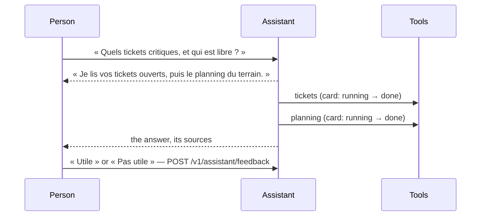

# Spec 053 — The chat says its plan, and hears whether it helped

## Why

A person trusts an answer when she sees how it was made and when her word on it counts. The chat
of spec 027 already shows each tool it calls as a card, running then done, and the sources it
read. Two things were missing: the assistant did not say what it was about to do before doing
it, and she had no way to say « this helped » or « this did not » — so nobody could tell whether
the assistant was worth its cost.

Built on what exists: the chat on assistant-ui (spec 027), its tool cards and sources, the
assistant beside the page (spec 048); assistant-ui's feedback adapter.

## The screens

## Rules

- **Its plan first**: before calling tools, the assistant says in one short sentence what it will
  read or prepare; each step then shows as its card. It still prepares and never decides.
- **Her opinion**: under each answer, « Utile » and « Pas utile »; one opinion per answer and
  person, changed as she likes, an optional reason; only on a conversation of hers; never while
  an administrator views a demo person's space (`assistant_feedback`, migration 0044, RLS).
- **Counted** for the organization's governance (spec 054): the share of answers found useful.
- The tools of the dashboards (spec 050) are named in her words on their cards.

## Proof

- `tests/drafts-chat.test.ts`: her opinion is kept once and changed, its reason replaced; a
  colleague cannot give one on her conversation.
