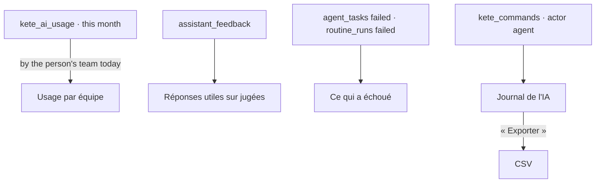

# Spec 054 — The governance of AI

## Why

An organization that lets assistants and agents work for its people must see what that costs,
whether it helps, what goes wrong, and what the AI did — and show it to an auditor. The
Administration › IA page of spec 014 showed the model, the personal-key policy, the monthly
budget and the use by purpose. It now also shows the use team by team, the share of answers its
people found useful (spec 053), what failed, and the journal of every action of an agent or the
assistant, exported as it is.

Built on what exists: `@kete/ai`'s usage journal, `@kete/commands`' journal, the structure's
chart (spec 002), the answers' opinions (spec 053), the agents' tasks (spec 036), the routines'
runs (spec 051).

## The screen

## Rules

- **For administrators only**, never while viewing a demo person's space (`GET /v1/governance`,
  `GET /v1/governance/journal`).
- **By team**: each use is counted for the person it was for, in the unit of the position she
  holds today; a use without a team is shown as such. Tokens and calls only: no invented figure
  of time saved.
- **Useful answers**: the opinions given this month (spec 053), helpful out of judged.
- **Failures**: the agents' tasks and the routines' runs that failed this month.
- **The journal**: every command an agent or the assistant ran — when, who, for whom, through
  which channel, its summary, whether it can be undone — the latest first; exported as CSV in the
  browser, nothing kept elsewhere.

## Proof

- `tests/governance.test.ts`: use by team this month, another organization's never counted; the
  share of useful answers; failures; the journal of an agent's action with its person and channel;
  refused to a member.
