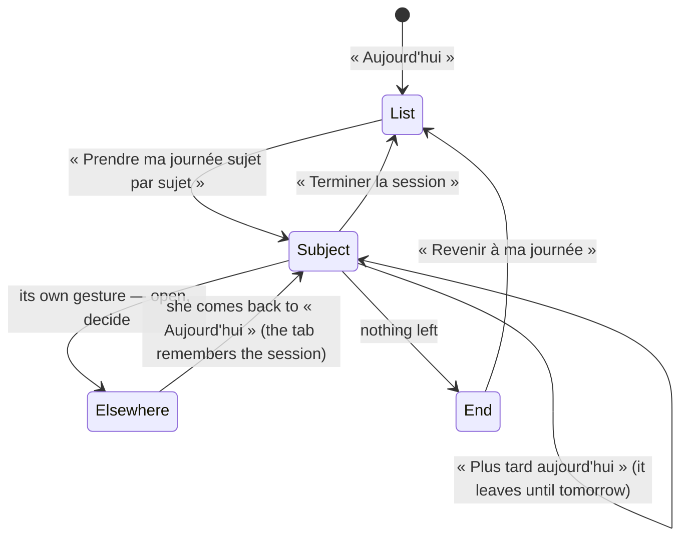

# Spec 058 — « Aujourd'hui » as a session, and « Pendant ce temps »

## Why

« Aujourd'hui » (spec 046) lists what waits for a person. A list invites her to scan it and pick;
a morning is settled faster one subject at a time, with nothing else in front of her. And while
she works, her agents and her routines work too — she should see that without looking for it.

This spec adds two things to « Aujourd'hui »:

- **The session**: one subject at a time, with its own gesture, « Plus tard aujourd'hui » and
  « Passer au suivant »; a count of what is settled, set aside and left; an end that says what
  was done.
- **« Pendant ce temps »**: the tasks her agents are doing for her and the routines running for
  her, right now.

Built on what exists: the day's subjects and their gestures (spec 046), « À faire » beside the
list (spec 047), the agents' tasks (spec 036), the routines' runs (spec 051).

## The session

## Rules

- **One subject at a time**, the most pressing first (the order of spec 046): its kind, its
  title, why it waits, and the same gestures as in the list — a draft is validated in place,
  anything else opens where it is settled.
- **« Plus tard aujourd'hui »** sets the subject aside for the day (`POST /v1/today/later`). It
  leaves the session and the list of « Aujourd'hui », and comes back tomorrow by itself. It still
  waits in « À faire » and still counts beside it: nothing is hidden for longer than the day.
  « Les reprendre » takes back everything set aside (`POST /v1/today/resume`).
- **« Passer au suivant »** moves on without setting anything aside: the subject comes round again.
- **The count** says how many of the subjects the session started with are settled (they no longer
  wait), set aside, and how many are left. A subject that arrives during the session joins it.
- **The tab remembers**: the session's starting subjects are kept in the browser tab, so that she
  finds her session when she comes back from a subject she opened. Nothing else is stored in the
  browser; what is set aside is kept by the API, with her account.
- **Hers alone**: nobody sets aside or takes back for her — refused while viewing another's space.
- **« Pendant ce temps »** lists her agents' tasks that are queued or running, and her routines'
  runs that are queued or running, with a link to each page. It shows when something runs, and
  always during a session — then it also says when nothing runs. What the apps did since
  yesterday stays in the briefing (spec 046).

## The data

`today_set_aside (organization_id, user_id, item_key, day)` — one row per subject and per day,
isolated by organization (RLS). `item_key` is « kind:id », as « Aujourd'hui » lists its subjects.
The rows of past days are removed at the next gesture.

`GET /v1/today` gains `later` (the keys set aside today) and `meanwhile` (`agents`, `routines`).

## Proof

- `tests/today-session.test.ts`: a subject set aside is in `later`, still in the day's list, and
  not in a colleague's; taken back alone or all at once; a key that is not a subject is refused;
  yesterday's are forgotten; a task given to an agent shows in `meanwhile` until it is done, then
  in what was done — and a colleague sees none of it.
