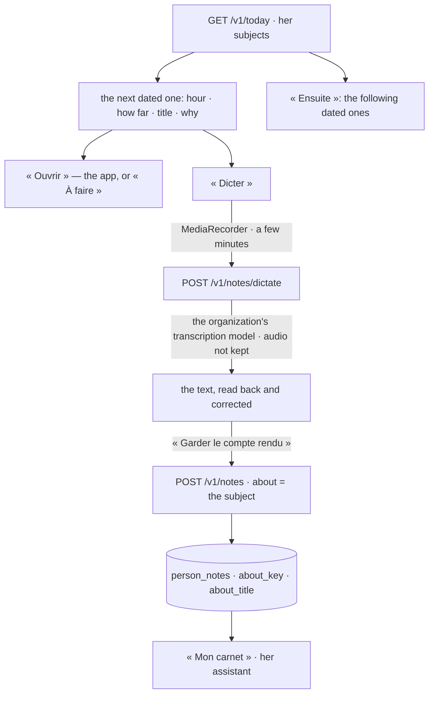

# Spec 059 — « Terrain »: the day on a phone, outdoors

## Why

A field technician reads Kete on a phone, often an entry-level one, outdoors, with one hand
free. The workspace's screens are made for a desk: many small targets, a dark theme that fades in
bright light, a keyboard assumed. « Terrain » is the same day, read for those conditions: her
next dated subject in large type, one gesture to open it, a report she dictates and reads back,
and what comes after.

Built on what exists: the day's subjects (spec 046), her notebook (spec 055), the transcription
of what was said (spec 035), the light theme (`@kete/design`).

## What Enterprise knows, and what the field app knows

An intervention's details — the address, the parts to bring, the customer to call, the last
visit — belong to the field app (`kete-fieldwork`, its own repository, not built yet). Enterprise
knows what the apps hand it: a thing to do, with its title, its moment and where it opens.
« Terrain » shows that, and opens the app for the rest. It invents no detail.

## The page

## Rules

- **The next one**: among her subjects with a moment, the first still to come; when all are past,
  the latest one that still waits, said late. Its hour in large type, how far it is (« dans
  40 min »), its day, its title, why it waits. « Ouvrir » leads where it is settled.
- **Large targets**: every gesture of the page is at least 56 px high and as wide as the column;
  the text is larger than the workspace's.
- **« Plein soleil »** turns the light theme on — dark text on a light ground, which reads better
  in bright light — and off again. It is the workspace's theme choice, kept with the device.
- **« Dicter »**: she speaks for up to five minutes and says « J'ai fini »; the recording goes to
  the API, is transcribed by the organization's transcription model and is never kept; the use is
  counted (`dictation`). She reads the text back and corrects it. She can dictate more: it is
  added below. Nothing is stored until she keeps it.
- **Kept where it can be read again**: « Garder le compte rendu » writes it in her notebook
  (spec 055) with what it reports on — the subject's key and title. « Mon carnet » shows
  « Compte rendu de : … », and her assistant reads it among her latest notes, so she can ask it
  to file the report or pass it on. Filing it in the field app is the app's own gesture.
- **When the phone cannot record** — no microphone, permission refused, a browser without
  recording — the page says so and she writes the report instead. Without a transcription model,
  dictation says it is not available.
- **Hers alone**: no dictation while viewing another's space.
- **Not in this spec**: working offline (a report kept on the phone until the network returns),
  the route, the call, the photos — the field app's, and `@kete/offline`'s when it exists.

## Proof

- `tests/notes.test.ts`: dictation refused without a transcription model; a recording becomes the
  text she reads back and nothing is stored; a recording that is not audio, or empty, is refused;
  the note kept says what it reports on, and one that reports on nothing says so; an unknown
  subject key is refused.
- `tests/meeting-records.test.ts` still passes: meetings read their recordings through the same
  `platform/transcription.ts`.
